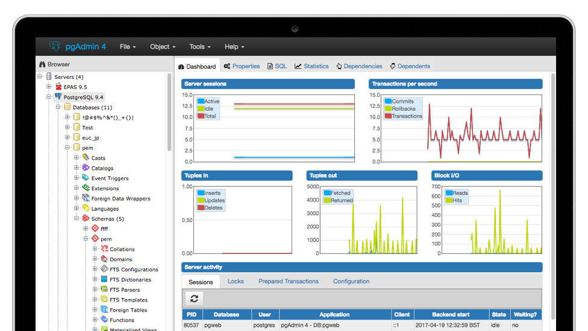

# Guía de Administración Básica de PostgreSQL

 

## Presentación

Esta guía brinda la oportunidad de crear, desarrollar y gestionar bases de datos
objeto-relacionales, planteando formas eficientes de administrar y
monitorizar el motor de bases de datos PostgreSQL. La mayoría de
del software actual tiene la necesidad de interactuar con bases de datos y PostgreSQL
es uno de los motores relacionales de código abierto más robustos, seguros y
utilizados en distintos entornos (Transaccionales u OLAP) junto 
con distintos tipos de aplicaciones (GIS, ERPs, CRMs ...).

En la actualidad cada vez se solicitan más perfiles técnicos con
habilidades mixtas como devops. Si eres un desarrollador de software o
un administrador de sistemas, te interesará ampliar tus conocimientos
sobre sistemas gestores de bases de datos relacionales, ya que son una parte
fundamental de cualquier sistema IT actual.

## Target

Este guía está pensada para a una amplia audiencia con un perfil técnico: 
que esté interesada en conocer y profundizar en el funcionamiento y
administración de un sistema gestor de bases de datos orientado a
objetos (ORDBMS) como PostgreSQL. Resultará especialmente útil a desarrolladores
de software, devops o administradores de sistemas con un interés especial en
configurar y optimizar el rendimiento de PostgreSQL. También es el
complemento perfecto para usuarios y desarrolladores de PostGIS, ya que
esta herramienta cartográfica está diseñada específicamente para PostgreSQL.

 

## Temas

- Instalación y configuración para distintos entornos

- Lenguaje SQL y PLpg/SQL

- Creación y gestión de bases de datos

- Seguridad

- Optimización de rendimiento

- Monitorización y mantenimiento

- Copias de seguridad y restauración

- Actualizaciones

## Guía

La guia está en: <https://github.com/lesandie/guia-postgres/blob/main/guia/guia_postgres_v21a.md>
