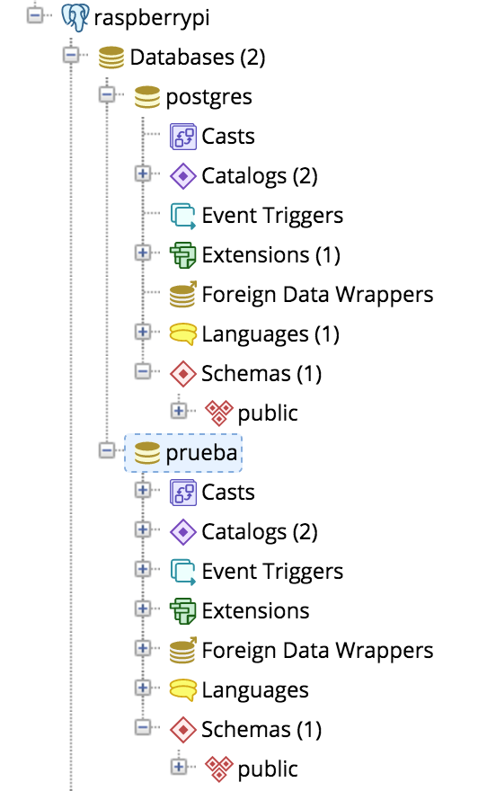
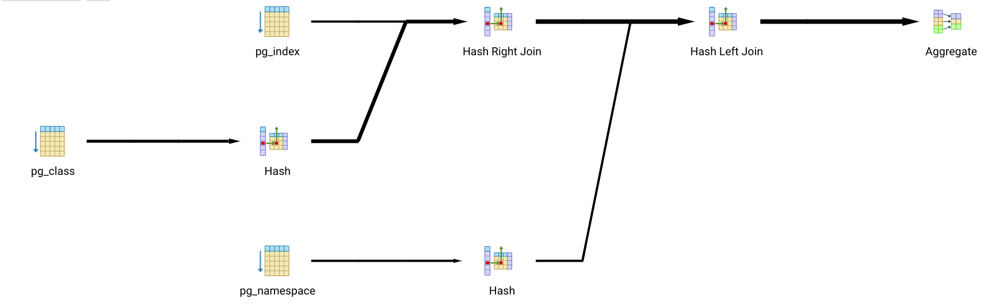

# PostgreSQL Avanzado

Revisión 2021

## Indice

[Tema 01: Instalación y configuración de PostgreSQL](#Toc444422180)

1. [Instalación](#Toc4684821)
1.1. [Requerimientos](#Toc4684822)
1.2. [Instalación en Windows](#Toc4684824)
1.3. [Instalación en RedHat/CentOS](#Toc4684825)
1.4. [Instalación en Debian/Ubuntu 7](#Toc4684826)
2. [Configuración](#Toc444422183)
2.1. [Arranque Automático](#Toc4684828)
2.2. [Codificación de caracteres e idiomas](#Toc4684829)
2.3. [Parámetros](#Toc4684830)
3. [Actualizaciones](#Toc4684831)

[Tema 02: Estructura y almacenamiento en PostgreSQL 10](#Toc4684832)

1. [Arquitectura básica](#Toc4684833)
2. [Subsistemas PostgreSQL](#Toc4684834)
3. [Componentes de PostgreSQL](#Toc4684835)
3.1. [Bases de datos Template (de sistema)](#Toc4684836)
3.2. [Bases de datos (de usuario)](#Toc4684837)
3.3. [Roles](#Toc4684838)
3.4. [Esquemas](#Toc4684839)
3.5. [Tablespaces](#Toc4684840)
3.6. [Tablas](#Toc4684841)

[Tema 03: Técnicas avanzadas en PostgreSQL](#Toc4684842)

1. [Funciones](#Toc4684843)
1.1. [Funciones anónimas](#Toc4684844)
1.2. [Funciones PostgreSQL](#Toc4684845)
2. [Lenguaje PL/pgSQL](#Toc4684846)
2.1. [Variables y bloques funcionales](#Toc4684847)
2.2. [Estructuras condicionales](#Toc4684848)
2.3. [Estructuras iterativas](#Toc4684849)
2.4. [Gestión de excepciones](#Toc4684850)
2.5. [SQL Dinámico](#Toc4684851)
3. [Triggers](#Toc4684852)
3.1. [Creación de triggers e integración con funciones](#Toc4684853)
4. [Indices](#Toc4684854)
4.1. [Uso de índices](#Toc4684855)
4.2. [Tipos de índices](#Toc4684856)
4.3. [Estrategias de indexado](#Toc4684857)
5. [Vistas](#Toc4684858)
6. [Transacciones](#Toc4684859)
6.1. [Propiedades ACID](#Toc4684860)
6.2. [Log de transacciones](#Toc4684861)
6.3. [Checkpoints y Savepoints](#Toc4684862)
6.4. [Concurrencia y niveles de aislamiento](#Toc4684863)

[Tema 04: Seguridad en PostgreSQL](#Toc4684864)

1. [Mecanismos de autenticación](#Toc4684865)
2. [Estructura de pg_hba.conf](#Toc4684866)
3. [Mecanismos de cifrado](#Toc4684867)
3.1. [Conexiones seguras con SSL](#Toc4684868)
3.2. [Túneles SSH](#Toc4684869)
4. [Acceso y privilegios del sistema (proxy auth)](#Toc4684870)
5. [Niveles de seguridad](#Toc4684871)

[Tema 05: Monitorización y mantenimiento](#Toc4684872)

1. [Inicio y parada con pg_ctl](#Toc4684873)
2. [Configuración de logs](#Toc4684874)
2.1. [Destinos de log y parámetros de configuración](#Toc4684875)
2.2. [Formateo de logs para facilitar su lectura](#Toc4684876)
2.3. [Mantenimiento y limpieza](#Toc4684877)
2.4. [Catalogo del sistema y estadísticas](#Toc4684878)

[Tema 06: Copias de seguridad y restauración](#Toc4684879)

1. [Importado y exportado de datos](#Toc4684880)
2. [Copias de seguridad](#Toc4684881)
2.1. [Parámetros y formato de backups](#Toc4684882)
3. [Restauración](#Toc4684883)
4. [Restauración Point-in-Time](#Toc4684884)
4.1. [Log de transacciones (WAL)](#Toc4684885)
4.2. [Configuración de archivado](#Toc4684886)
4.3. [Copias base](#Toc4684887)
4.4. [Proceso de restauración](#Toc4684888)
5. [Automatización de backups](#Toc4684889)

[Tema 07: Rendimiento y optimización](#Toc4684890)

1. [Consideraciones hardware](#Toc4684891)
2. [Configuración OLTP/OLAP](#Toc4684892)
3. [Número de conexiones](#Toc4684893)
4. [Memoria](#Toc4684894)
4.1. [Shared buffers](#Toc4684895)
4.2. [Working Memory](#Toc4684896)
4.3. [Effective cache size](#Toc4684897)
5. [Optimización de consultas](#Toc4684898)
5.1. [EXPLAIN y plan de consultas](#Toc4684899)
5.2. [Errores en la escritura de consultas](#Toc4684900)
5.3. [Uso erróneo de índices](#Toc4684901)
5.4. [Uso erróneo de CTEs (Common Table Expressions)](#Toc4684902)
5.5. [Uso de PL/pgSQL](#Toc4684903)
5.6. [Particionado de tablas](#Toc4684904)

## Tema 01: Instalación y configuración de PostgreSQL

### Instalación

#### Requerimientos

Sería necesario disponer de unos requerimientos básicos de hardware,
software y espacio en disco. PostgreSQL es un SGBD poco pesado y se
puede instalar en distintos entornos hardware: portátiles, sobremesas,
servidores, máquinas virtuales o incluso en una raspberry pi.

Hardware

Los requisitos mínimos que deberíamos tener para instalarlo serían

a)  1 procesador/core

b)  1GB de RAM

c)  8GB de espacio en disco.

Estos requisitos servirían para probar el software de manera básica pero
no nos van a permitir explotar al máximo todas las características y
opciones de PostgreSQL. Para ello recomendamos disponer de:

d)  2+ procesadores/cores

e)  2GB-4GB+ de RAM

f)  16GB+ de espacio en disco

Software

En cuanto a software nos referimos principalmente al sistema operativo.
En este caso se recomienda Linux o Windows, preferiblemente Linux ya que
nos permitirá sacar mayor partido a PostgreSQL. Se recomiendan dos
distribuciones estándar, RedHat o Ubuntu.

Paquetes Contrib

Estos paquetes aglutinan una serie de funcionalidades añadidas que son
interesantes. Se instalan como software añadido en la versión 9 de
PostgreSQL pero en la versión 10 ya están integrados en la instalación.

#### Instalación en Windows

La instalación en Windows se realiza de manera gráfica. Lo primero que
hay que hacer es bajarse el instalador gráfico de:

<https://www.enterprisedb.com/es/downloads/postgres-postgresql-downloads>

Una vez seleccionada la versión, que en nuestro caso es la 13 para
Windows x64, procederemos a su instalación en nuestra máquina virtual o
PC.

#### Instalación en RedHat/CentOS

Para RedHat/CentOS debemos tener instalado el repositorio EPEL, ya que
los paquetes de PostgreSQL tienen ciertas dependencias con paquetes
de este repositorio. Recomendamos RedHat 7.4+ o CentOS 7.4+

E01.01: Instalación de PostgreSQL en RedHat Linux

Para instalar EPEL, simplemente ejecutar el comando:

```bash
yum install epel-release
```

Después accederemos a la web de postgres:

<https://www.postgresql.org/download/linux/redhat/>

Aquí podremos seguir paso a paso las instrucciones que nos detalla la
web. Una vez seleccionada nuestra plataforma el comando resultante para
instalar el repositorio oficial de PostgreSQL sería:

```bash
yum install yum install https://download.postgresql.org/pub/repos/yum/reporpms/El-7-x86_64/pgdg-redhat-repo-latest.noarch.rpm
```

Una vez instalado el repositorio ejecutar para actualizar la lista de
paquetes de los repositorios:

```bash
yum update
```

Una vez actualizada la lista de paquetes, vamos a proceder a instalar
PostgreSQL y el paquete de software de las aplicaciones cliente. Para
ello ejecutar:

```bash
yum install postgresql13 postgresql13-server
```

#### Instalación en Debian/Ubuntu

Para instalar PostgreSQL es recomendable disponer de Debian 9+ o
Ubuntu 18.04+. Para ello debemos visitar
https://www.postgresql.org/download/linux/ubuntu/ y seleccionar las
versiones de Debian y Ubuntu que estemos utilizando. En nuestro caso
Debian 9 es stretch y Ubuntu 16.04 es bionic

Creamos y editamos el fichero /etc/apt/sources.list.d/pgdg.list y
añadimos la línea

a)  Debian 9: deb http://apt.postgresql.org/pub/repos/apt/ stretch-pgdg
    main

b)  Ubuntu 18.04: deb http://apt.postgresql.org/pub/repos/apt/
    bionic-pgdg main

A continuación instalamos la utilidad wget y de gestión de certificados,
descargamos la clave pública y actualizamos los repositorios.

```bash
sudo apt-get install wget ca-certificates
wget --quiet -O - https://www.postgresql.org/media/keys/ACCC4CF8.asc | sudo apt-key add -
sudo apt update & upgrade
```

Finalmente instalamos postgreSQL ejecutando:

```bash
sudo apt install postgresql-13 postgresql-client-13
```

### Configuración

En nuestro caso, los ficheros de configuración que editaremos para
configurar el comportamiento del SGBD son:

```bash
/etc/postgresql/postgresql.conf
/etc/postgresql/pg_hba.conf
```

En el primero están las directivas de uso de memoria, almacenamiento,
logging y tunning. Veremos con más detalle estas directivas en los
capítulos de almacenamiento, monitorización y optimización, entre otros.

El segundo se utiliza para controlar los accesos y definir los métodos
de autenticación. Veremos con más detalle las directivas de este fichero
en el capítulo de seguridad.

#### Arranque Automático

Para configurar el arranque automático del servicio de PostgreSQL
simplemente tendremos que utilizar systemctl ejecutando:

```bash
sudo systemctl enable postgresql
```

Para inicializar el espacio de almacenamiento por defecto ejecutar:

```bash
sudo systemctl start postgresql
```

Después de la inicialización, los ficheros con las bases de datos están
en:

```bash
/var/lib/postgresql
```

Y los ficheros de configuración en:

```bash
/etc/postgresql
```

En nuestro caso, los ficheros de configuración más importantes son:

```bash
/etc/postgresql/postgresql.conf
/etc/postgresql/pg_hba.conf
```

Para hacer una parada del servicio simplemente hay que ejecutar:

```bash
sudo systemctl stop postgresql
```

#### Codificación de caracteres e idiomas

PostgreSQL permite almacenar texto en una gran variedad de
codificaciones de caracteres o *encodings*, propias de cada idioma o
*locale*. Las codificaciones pueden ser de tipo *single-byte* como la
ISO 8859 (también conocida como Latin1, propia del español, francés o
italiano) o *multi-byte* como EUC (Extended Unix Code) o UTF-8, que
posiblemente sea el tipo de codificación más moderna y más utilizada por
su versatilidad. UTF-8 soporta un número mayor de caracteres que ISO
8859, que sólo soporta 256.

Los idiomas y codificaciones disponibles dependerán de qué idiomas haya
instalado el administrador en el sistema operativo. En el sistema
operativo puede haber instalados varios idiomas con sus codificaciones
correspondientes y cada usuario puede tener configurado su idioma
preferido. Cada idioma puede soportar una o varias codificaciones. Con
el siguiente comando se puede comprobar que idiomas hay instalados en el
sistema:

```bash
sudo locale -a
```

Cuando un cliente se conecta, selecciona el idioma y codificación con
los que haya sido configurado el servidor. Cuando se inicializa
PosgreSQL, se selecciona el idioma y la codificación que haya
configurado por defecto en postgresql.conf pero si eliminamos la
configuración de idioma y codificación del fichero, PostgreSQL heredará
la configuración de idioma y codificación del sistema operativo. Para
inicializar postgres y especificar el idioma y codificación:

```bash
sudo pg_ctl initdb ---locale=es_ES.UTF8
```

Siguiendo las anteriores reglas, podríamos crear y configurar una nueva
base de datos con un conjunto de caracteres distinto al haya
especificado por defecto con esta comando SQL:

```sql
CREATE DATABASE "curso-postgresql" WITH ENCODING 'UTF8' LC_COLLATE='es_ES.UTF8' LC_CTYPE='es_ES.UTF8' TEMPLATE=template0;
```

Ocasionalmente es útil mezclar distintas reglas de configuración de
idiomas y conjuntos de caracteres, por ejemplo usar reglas de orden
inglesas para las fechas (yyyy-mm-dd) pero que los mensajes sean en
español. Para poder hacer esto existen una serie de subcategorias o
variables de idioma que controlan este tipo de comportamientos:

| Variable | Descripción |
| ---------| ----------- |
| LC_COLLATE | Orden de clasificación de la cadena |
| LC_CTYPE | Clasificación de caracteres (¿Que es una letra?.¿Cual es su equivalente en mayúsculas?) |
| LC_MESSAGES | Idioma de los mensajes |
| LC_MONETARY | Formato de monedas (símbolo euro) |
| LC_NUMERIC | Formato de números |
| LC_TIME | Formato de fechas y hora |

Una restricción importante es que el conjunto de caracteres con el que
se va a configurar una nueva base de datos tiene que ser compatible con
las variables LC_CTYPE y LC_COLLATE configuradas por defecto. Esto es
debido a que en Linux hay varios idiomas que sólo soportan un tipo de
codificación por ejemplo el Koreano sólo soporta EUC sin embargo en
Windows todos los idiomas soportan la codificación UTF-8.

#### Parámetros

A continuación se detallan los parámetros a configurar en el fichero
**postgresql.conf**

```bash
# - Locale and Formatting -

datestyle = 'iso, dmy'
timezone = 'localtime'
```

Los dos primeros parámetros seleccionan el formato de fecha, que en
nuestro caso es ddmmaa y el control del tiempo se deja en manos del
sistema operativo:

```bash
# These settings are initialized by initdb, but they can be changed.

lc_messages = 'en_US.UTF-8' # locale for system error messages
lc_monetary = 'en_US.UTF-8' # locale for monetary formatting
lc_numeric = 'en_US.UTF-8' # locale for number formatting
lc_time = 'en_US.UTF-8' # locale for time formatting
```

Los parámetros lc_* controlan la codificación de números, monedas y
hora.

```bash
# default configuration for text search

default_text_search_config = 'pg_catalog.english'
```

Mediante este parámetro habilitamos las búsquedas de texto dentro del
catalogo del sistema en inglés, que es su forma nativa. En posteriores
temas veremos el catálogo de sistema.

#### Actualizaciones

Como habréis podido comprobar, la versión de PostgreSQL consiste en 3
dígitos:

Releases menores: 9.6.1, 9.6.2, 9.6.5 ...

Releases mayores: 9.4.0, 9.5.0, 9.6.0 o 10.0.1

Releases N.0.0: 8.0.0, 9.0.0, 10.0.0, 11.0

La distinción entre releases es bastante importante, ya que para las
menores no hace falta más que parar el servicio, actualizar los paquetes
y volver a levantar el servicio, debido a que sólo se concentran en
corregir errores (bug fixes), mientras que una reléase mayor, aporta
nuevas funcionalidades y cambios, que pueden entrar en conflicto con la
versión de postgreSQL que tengamos corriendo. En caso de actualizar a
una release mayor o a una N.0.0, será necesario que hagamos un volcado
lógico de nuestras bases de datos con *pg_dump* y después de actualizar
hagamos un *pg_restore*

Para actualizar los paquetes hay que utilizar los gestores de paquetes
de RedHat o Debian, yum y apt respectivamente:

Para Redhat/CentOS con el comando yum update actualizaremos la lista de
paquetes del sistema operativo y con yum upgrade ejecutaremos la
actualización de los paquetes de software. Para Debian/Ubuntu
utilizaremos sudo apt update y sudo apt upgrade respectivamente.

## Tema 02: Estructura y almacenamiento en PostgreSQL

En este capítulo estudiaremos la arquitectura de PostgreSQL desde el
punto de vista de un SGBD, revisando el paradigma Cliente-Servidor.
También descubriremos que subsistemas y procesos forman parte de
PostgreSQL y sus funciones asociadas, como la gestión del
almacenamiento. Por último profundizaremos en los componentes más
importantes de la estructura lógica de PostgreSQL, como plantillas,
esquemas o *tablespaces*.

### Arquitectura básica

PostgreSQL utiliza un modelo cliente-servidor, donde los clientes y el
servidor pueden estar en distintos *hosts.* La comunicación entre ambos
se realiza via TCP/IP. PostgreSQL puede gestionar múltiples conexiones
desde un solo cliente. El mecanismo de gestión de conexiones se realiza
mediante *forking* de procesos, es decir por cada nueva conexión el
sistema operativo genera un nuevo proceso cuya vida dura desde la
apertura de la conexión hasta su finalización. Para más información
sobre procesos del sistema operativo:

<https://es.wikipedia.org/wiki/Proceso_(inform%C3%A1tica)>

### Subsistemas PostgreSQL

Siguiendo las directrices de un modelo cliente-servidor, PostgreSQL
puede dividirse en 4 subsistemas: gestor de procesos, procesador de
consultas o *queries*, utilidades y gestor del almacenamiento. A
continuación se muestra una figura que describe la arquitectura general
de PostgreSQL:

<br>

Imagen de la arquitectura de PostreSQL

El **gestor de procesos** se encarga de gestionar las conexiones de los
distintos clientes, haciendo *forking* de procesos y terminándolos
cuando el cliente haya finalizado de operar.

La gestión de las consultas es la tarea principal del **procesador de
consultas**. Cuando un cliente envía una consulta/query a PostgreSQL, la
query es analizada por el *parser* y después el analizador de tráfico o
*traffic cop* determina el tipo de query y automáticamente se crea una
query modelo y se le pasa al subsistema de *utilities*, el cual
discrimina si se trata de una query DML (INSERT, UPDATE, SELECT y
DELETE) o DDL (CREATE o ALTER) y en el caso de ser DML la query es
reescrita por el *rewriter* seguida por la generación de un plan de
ejecución de la misma. Finalmente la query es ejecutada y se devuelven
los resultados al cliente.

El subsistema **utilities** proporciona métodos de bajo nivel para el
mantenimiento de la base de datos como, liberar espacio de
almacenamiento, actualización de estadísticas del sistema, etc.

Por último el **gestor de almacenamiento** gestiona la memoria cache,
los buffers de disco, o la gestión del espacio de almacenamiento. En los
siguientes capítulos veremos como configurar y optimizar cada uno de
estos sistemas y subsistemas.

### Componentes de PostgreSQL

Entender la lógica de la organización de los componentes de PostgreSQL
ayuda a comprender como son las relaciones e interacciones entre los
objetos que componen una base de datos. Las bases de datos, roles,
*tablespaces*, *settings,* o lenguajes plantillas comparten el mismo
nivel de jerarquía, como se puede apreciar en la imagen siguiente:

<br>

#### Bases de datos Template (de sistema)

Por defecto, cuando se crea una base de datos, esta es clonada de una
base de datos *template* o de sistema, llamada template1

Las bases de datos *template*, tienen una serie de tablas, vistas y
funciones que se utilizan para modelizar las relaciones entre los
objetos de bases de datos definidos por los usuarios y son parte del
*catálogo del sistema* o *pg_catalog*.

La siguiente imagen intenta explicar de una forma visual el anterior párrafo:

<br>

Como se puede observar tanto la base de datos postgres como la base de
datos prueba, comparten la misma estructura y jerarquía de objetos
(triggers, esquemas, extensiones ... etc, etc). Esta estructura
jerárquica la han heredado de la base de datos template1 y es la misma
para todas las bases de datos que se creen.

PostgreSQL tiene dos bases de datos *template*:

a)  ***template1*** es la base de datos que se clona por defecto. Al
    modificar esta plantilla todas las nuevas bases de datos que se
    clonen, heredarán las modificaciones. Esto no afectaría a las bases
    de datos ya creadas.

b)  ***template0*** es una copia de seguridad de template1 por si esta
    se corrompiese. Además template0 no contiene información sobre
    codificaciónes de caracteres.

#### Bases de datos (de usuario)

Podemos tener tantas bases de datos como queramos en una instancia de
PostgreSQL. Los clientes sólo pueden conectarse y acceder a una sóla
base de datos, especificada en la cadena de conexión. Eso significa que
no hay datos compartidos entre distintas bases de datos. Cada base de
datos tiene un dueño y un conjunto de permisos asociados que controlan
el tipo de acciones asignadas a un *rol*. Estos permisos se aplican a
los objetos que forman la base de datos como, vistas, tablas,
secuencias, índices etc.

Para conectarnos con el usuario postgres a la instancia de PostgreSQL
utilizamos el comando:

```bash
sudo psql -U postgres -W postgres
```

en el que espeficicamos con -U el usuario y con -W una clave

A continuación con los metacomandos **x** de vista extendida y **l** de listado, podremos ver todos los detalles de todas las bases de datos que
hay en la instancia PostgreSQL. Cada base de datos, tiene asociados una
serie de usuarios y privilegios de acceso:

a)  Create (-C) permite al usuario crear nuevas bases de datos.

b)  Connect (-c) permite al usuario conectarse.

c)  Temporary (-T) permite el acceso a tablas temporales.

Además de estos atributos, hay otros que hacen referencia al
mantenimiento y gestión de las bases de datos, que veremos en capítulos
posteriores.

#### Roles

Los roles pertenencen a una instancia de PostgreSQL y no a una base de
datos. Un rol poder ser un usuario o un grupo de usuarios. El concepto
de rol aglutina los conceptos de usuarios y grupos, como en Unix. Las
versiones antigüas de PostgreSQL mantienen este paradigma, que ha
cambiado en las versiones actuales. Es por ello que los comandos CREATE
USER y CREATE GROUP se mantienen por retrocompatibilidad, pero en las
versiones nuevas se recomienda utilizar CREATE ROLE.

A continuación detalla la estructura relacional de la entidad Rol:

<br>

Diagrama ER de la entidad Rol

Los roles tienen varios atributos:

a)  **Super user:** Este role puede superar todas las comprobaciones de
    permisos excepto la de login.

b)  **Login:** Un rol con este atributo puede ser usado por un cliente
    para conectarse a una base de datos.

c)  **Create database:** este atributo permite crear bases de datos.

d)  **Initiating replication:** un rol con estre atributo permite la
    replicación por streaming.

e)  **Password:** El atributo password puede ser utilizado con el método
    de autenticación md5. Además puede ser cifrado. La caducidad del
    password puede ser controlada especificando la validez el período de
    validez. Este password está en una capa superior al password del
    sistema operativo.

f)  **Connection limit:** Este atributo especifica el número de
    conexiones que el usuario puede iniciar. La creación de conexiones
    consume recursos hardware (RAM y procesador) y es por ello que se
    recomienda utilizar herramientas de pooling (pgpool-II, pgbouncer).

g)  **Inherit:** Si este atributo ha sido especificado entonces el rol
    heredará los atributos de los roles de los que depende.

Cuando se crea una instancia de PostgreSQL, por defecto se crea el rol
de superusuario *postgres*, con el cual podemos crear y modificar otros
roles. Un rol puede ser miembro de otro rol, para simplificar el acceso
y gestión de los permisos. Por ejemplo, podríamos crear un rol con el
atributo no login, también conocido como group y permitirle que pueda
acceder a determinados objetos de nuestra base de datos, de manera que
si necesitásemos que un nuevo rol tuviese los mismos permisos que el
anterior rol que creamos, simplemente con asignarle el grupo al nuevo
rol sería suficiente. Los comandos GRANT y REVOKE, los cuales veremos el
tema de seguridad con más detalle, gestionan la asignación de roles y
permisos.

Prácticamente, el comando CREATE USER es equivalente a CREATE ROLE con
el atributo LOGIN y CREATE GROUP es equivalente a CREATE ROLE con el
atributo NOLOGIN.

Para comprobar qué atributos se pueden utilizar con el comando CREATE
ROLE se recomienda visitar:

<https://www.postgresql.org/docs/current/role-attributes.html>

#### Esquemas

Una base de datos PostgreSQL podría ser considerada como un contenedor
para un esquema de bases de datos. Los esquemas se utilizan para
organizar los objetos de una base de datos de la misma manera que
lenguajes de programación de alto nivel organizan sus *namespaces.* Un
esquema contiene todos los objetos de base de datos, como tablas,
vistas, funciones, índices, secuencias, triggers, rangos, etc. Los
objetos de una base de datos, pueden ser reusados entre distintos
esquemas sin que haya conflictos.

Un esquema se podría considerar como un subconjunto de una base de
datos. Por ejemplo si tenemos una base de datos de clientes y
proveedores, un esquema podría ser de clientes, con sus tablas,
procedimientos, índices, triggers ... y otro el de proveedores. La unión
de ambos esquemas formaría nuestra base de datos.

<br>

Esquema PosgreSQL visto como un contenedor de objetos de una base de
datos

Por defecto, siempre hay un esquema denominado public en cada base de
datos. Todos los usuarios, por defecto, pueden acceder a este esquema
implícitamente. Este comportamiento se hereda de las bases de datos
template.

Cuando un usuario quiere acceder a un objeto en concreto, necesita
especificar el nombre del esquema y el del objeto separados por un punto
(*qualified naming*). Por ejemplo, para acceder a todos los objetos del
esquema *pg_catalog* de la base de datos *pg_database* tendríamos que
utilizar el comando:

```sql
SELECT * FROM pg_catalog.pg_database;
```

Los esquemas normalmente son utilizados para:

a)  **Control y autorización**, en entornos con múltiples bases de
    datos, los esquemas pueden utilizarse para agrupar objetos en base a
    determinador roles.

b)  **Organización de los objetos de bases de datos**, ya que los
    esquemas pueden agrupar y ordenar objetos de bases de datos que
    sigan una lógica de aplicación o negocio

c)  **Mantener código SQL de terceros**: las extensiones que están
    disponibles en el paquete contrib u otras como PostGIS, tienen sus
    propios esquemas, haciendo más fácil su actualización o
    reutilización.

Con el comando SQL:

```sql
CREATE SCHEMA <nombre_del_esquema> AUTHORIZATION <nombre_del_rol>;
```

podemos crear un esquema vinculado al rol que queramos.

#### Tablespaces

Un espacio de tablas o *tablespace* es un espacio de almacenamiento para
objetos o bases de datos. Los tablespaces son utilizados por los admins
con distintos propósitos:

a)  **Mantenimiento**: si el disco duro, donde se ha creado la instancia
    de PostgreSQL, se queda sin espacio se puede crear un tablespace en
    otro disco o partición.

b)  **Optimización**: Se pueden crear tablespaces en discos SSD para un
    acceso más rápido a los datos más críticos y otros en discos más
    lentos que tengan datos a los cuales se accede con menos frecuencia

CREATE TABLESPACE es el comando que se utiliza para crear espacios de
almacenamientos adicionales. Por ejemplo podríamos crear un tablespace
para almacenar datos de una base de datos y crear otro tablespace para
almacenar índices.

```sql
CREATE TABLESPACE dbspace1 LOCATION '/DATA/dbspace1';
CREATE TABLESPACE idxspace1 OWNER alumno LOCATION '/DATA/idxspace2';
```

Para más información consultar:

<https://www.postgresql.org/docs/current/sql-createtablespace.html>

#### Tablas

Como en cualquier SGBDR, las tablas son pilares básicos sobre las que se
realizan casi todas las operaciones. En postgreSQL el comando CREATE
TABLE es muy potente, permitiéndonos por ejemplo desde poder
materializar el resultado de una consulta pesada para mejorar el
rendimiento hasta clonar tablas para hacer cálculos con los datos y no
tocar los originales. A continuación se explican los distintos tipos de
tablas en PostgreSQL:

**Tablas persistentes**: o *permanentes* son aquellas que su ciclo de
vida empieza con su creación con el comando CREATE TABLE y finaliza
cuando se elimina con DROP TABLE

**Tablas temporales**: el ciclo de vida de este tipo de tablas comienza
cuando el usuario inicia la sesión y finaliza con la sesión del usuario.
Son utilizadas normalmente por procedimientos almacenados en donde se
modelizan lógicas de negocio para aplicaciones.

**Tablas no-persistentes**: Las operaciones en tablas no persistentes o
*unlogged* son más rápidas que en tablas persistentes ya que los datos
no se escriben en el WAL (Write-Ahead Log). Este tipo de tablas no son
recuperables ante una caída de la instancia de PostgreSQL y no pueden
ser utilizadas para replicación entre nodos.

**Tablas heredadas**: son aquellas que heredan la estructura de una o
más tablas. El mecanismo de herencia normalmente se usa junto con
*constraints* para particionar físicamente los datos y que se pueda
obtener de manera más rápida un subconjunto de datos, seleccionando la
tabla heredada.

La sintaxis del comando CREATE TABLE es muy extensa, es por ello que se
recomienda consultar el manual de PostgreSQL:

<https://www.postgresql.org/docs/current/static/ddl-basics.html>

A su vez también se recomienda consultar los distintos tipos de datos
existentes en postgreSQL, que se utilizan a la hora de crear o modificar
tablas:

<https://www.postgresql.org/docs/current/static/datatype.html>

## Tema 03: Técnicas avanzadas en PostgreSQL

En este capítulo estudiaremos distintos objetos que tienen una
importancia relevante a la hora de administrar una instancia de
PostgreSQL. Empezaremos comprendiendo qué son los índices, sus tipos y
la importancia de una estrategia de indexado. Después abordaremos las
*constraints* y los *triggers* o disparadores, y como son un complemento
perfecto para asegurar la integridad referencial en una base de datos y
desarrollar funciones que nos permitan un control más fino de las
operaciones que manipulan datos sin necesidad de tocar las aplicaciones
que estén utilizándolos. A continuación veremos la utilidad de las
vistas y tablas temporales, después abordaremos las transacciones
utilizando el entorno gráfico de administración pgAdmin4.

### Funciones

Las funciones en PostgreSQL son un mecanismo distintivo que ofrece
nuevas posibilidades. Normalmente están compuestas por un bloque de
declaraciones y un bloque de código.

PostgreSQL nos permite crear funciones utilizando varios lenguajes como
PL/Python o PL/Perl, pero los más utilizados son PL/pgSQL y SQL, ya que
postgres los soporta directamente, sin necesidad de tener que crear una
extensión específica como en el caso de Python o Perl.

Las funciones se utilizan en distintos escenarios:

a)  Implementar lógicas de programación complejas.

b)  Ejecutar acciones antes o después de la ejecución de una consulta,
    utilizando el sistema de triggers.

c)  Limpiar de código SQL, reusando el código común y empaquetándolo en
    módulos.

d)  Automatización de tareas comunes.

La sintaxis para crear una función es como sigue:

```sql
CREATE OR REPLACE FUNCTION [nombre_función] ([param1], [param2]...[paramn]) RETURNS [tipo] AS $$
DECLARE
    [bloque de declaraciones]
BEGIN
    [bloque de código]
END;
$$ LANGUAGE SQL;
```

Veamos ahora las categorías de funciones en base a su definición. Cuando
creamos una función se marca como volátil por defecto si no lo
especificamos explícitamente. Una función volátil (VOLATILE) va a
devolver un resultado diferente cada vez que se ejecute, aunque el
argumento que se le pase sea el mismo.

Si una función no es de tipo volátil, entonces hay que especificar el
tipo, que puede ser estable (STABLE) o inmutable (INMUTABLE). Ambos
tipos de función se caracterizan por devolver el mismo resultado,
pasándoles el mismo parámetro. Las funciones estables garantizan este
comportamiento en el ámbito de ejecución de la consulta, mientras que
las inmutables lo garantizan de manera global. Por ejemplo, una función
estable que se ejecute dentro de una determinada consulta o transacción
va a devolver un valor distinto, a pesar de que se le pase el mismo
parámetro. Si se tratese de una función inmutable, el resultados siempre
sería el mismo a pesar de que se ejecutase en distintas transacciones o
consultas.

Algunos ejemplos de funciones postgres son, random() de tipo volátil ya
que siempre va a devolver un valor distinto, una función de tiempo como
now() es de tipo estable ya que va a devolver el mismo valor si se
ejecuta dentro de la misma consulta o transacción y finalmente round()
es una función inmutable ya que devuelve el mismo valor sea donde sea
que se ejecute. Veamos un ejemplo muy básico:

```sql
CREATE FUNCTION suma (sum1 INT, sum2 INT) RETURNS INT AS $$
DECLARE
    total INT;
BEGIN
    total := sum1 + sum2;
    RETURN total;
END;
$$ LANGUAGE 'plpgsql';
```

La anterior función retorna la suma dos enteros que le pasemos como
parámetros. Una función puede retornar un valor o nada, además de que
puede recibir parámetros o no. Un ejemplo de una función que no recibe
ningún parámetro y no retorna nada sería:

```sql
CREATE FUNCTION nada RETURNS VOID as $$
BEGIN
    RAISE NOTICE 'Esta función no hace nada';
END;
$$ LANGUAGE SQL;
```

Para llamar a una función desde SQL, podemos utilizar la instrucción SELECT:

```sql
SELECT suma(8,5);
```

y esta consulta nos devolvería 13.

Si hacemos lo mismo con la función nada:

```sql
SELECT nada();
```

Nos devolvería Empty e imprimiría el mensaje "esta función no hace nada"
en el log de postgres.

#### Funciones anónimas

A veces simplemente necesitamos comprobar que un código o un conjunto de
instrucciones básico funciona sin necesidad de crear una función. Para
ello disponemos de la instrucción DO, que nos permite hacer lo mismo que
una función pero sin necesidad de crearla. Veamos un ejemplo:

```sql
DO $$
DECLARE
    total INT;
    sum1 INT := 8;
    sum2 INT := 5;
BEGIN
    total := sum1 + sum2;
    SELECT total;
END $$;
```

##### Funciones PostgreSQL

PostgreSQL tiene una serie de funciones de alto nivel implementadas, las
cuales podemos utilizar desde consultas SQL o PL/pgSQL.

Para ver un detalle de todas las funciones de PostgreSQL podéis
consultar:

<https://www.postgresql.org/docs/current/functions.html>

Todas estas funciones están disponibles para ser llamadas desde
cualquier consulta SQL. A continuación vamos a crear una tabla básica:

```sql
CREATE TABLE personas (id INT PRIMARY KEY, nombre TEXT, apellidos TEXT);
INSERT INTO personas (id,nombre,apellidos) VALUES (1, 'Diego','Nieto Caride');
INSERT INTO personas (id,nombre,apellidos) VALUES (2, 'ALBERT','EINSTEIN');
INSERT INTO personas (id,nombre,apellidos) VALUES (3,'ada','lovelace');
```

Por ejemplo la función ```lower()``` convierte un string de mayúsculas a
minúsculas:

```sql
SELECT lower(nombre) FROM personas;
```

Esta consulta nos devolvería los nombres de todos los empleados en
minúscula.

```sql
SELECT upper(apellidos) FROM personas;
```

La anterior consulta nos devolvería los nombres de todos los empleados
en mayúsculas.

También podemos utilizar las funciones en el predicado de una consulta
de la siguiente manera:

```sql
SELECT nombre, apellidos FROM personas WHERE nombre = upper('diego');
```
### Procedimientos 

La diferencia entre procedimientos almacenados y funciones es que los procedimientos permiten ejecutar transacciones pero no devuelven ningún tipo de valor, al contrario que las funciones que si devuelven un resultado pero no permiten la ejecución de transacciones en ámbito de ejecución. 

Las procedimientos se utilizan en distintos escenarios: 

* Implementar lógicas de programación complejas. 
* Ejecutar acciones antes o después de la ejecución de una consulta, utilizando el sistema de triggers. 
* Limpiar código SQL, reusando el código común y empaquetándolo en módulos. 
* Automatización de tareas comunes. 

La sintaxis para crear un procedimiento es como sigue: 

```sql
CREATE OR REPLACE PROCEDURE add_persona(id INT, nombre TEXT, apellidos TEXT)
LANGUAGE plpgsql AS $$
DECLARE
--podemos declarar las variables que queramos 
BEGIN  
    --start transaction; 
    INSER INTO personas VALUES (id, nombre, appelidos);
    COMMIT;
END; $$ 
```
### Restricciones (Constraints) 

PostgreSQL ofrece la posibilidad de ejecutar una función automáticamente cuando se produce un evento relacionado con una operación DML como una INSERT, UPDATE, DELETE o TRUNCATE en alguna tabla o vista. Esta funcionalidad la aportan los disparadores o triggers.  
El Modelo E/R nos proporciona distintos tipos de restricciones de integridad que permiten establecer pautas de comportamiento en las Bases de Datos. Las restricciones son condiciones que deben ser ciertas en la Base de Datos y el SGBD se asegura de que éstas se cumplan.  

Estas restricciones pueden aplicarse sobre los siguientes elementos:  

* Un atributo – Restricción de atributo. Impone una condición sobre un atributo. 

* Una tabla – Restricción de tabla. Impone una condición sobre varios atributos de una tabla.  

* Varias tablas – Restricción general (ASSERTIONS). Impone una condición sobre varios atributos pertenecientes a varias tablas.  

* Un dominio – Restricción de dominio. Éstos solamente admiten las restricciones generales (CHECK). Los tipos de restricciones disponibles son:  

* Restricción de valor no nulo (NOT NULL) – Se viola si existe alguna tupla con valor nulo en el atributo. 

* Restricción de unicidad (UNIQUE) – Se viola si existen dos tuplas que posean el mismo valor en el atributo. 

* Restricción de clave primaria (PRIMARY KEY) – Esta restricción es una combinación de las dos anteriores. 

* Restricción general (CHECK) – Esta restricción permite especificar una expresión lógica para el atributo.  

* Restricción de clave foránea (FOREIGN KEY) – También conocida como integridad referencial , se viola si no existe ningún valor en el atributo de la tabla referida que se encuentre en el de la tabla de referencia.  


Las restricciones se definen del siguiente modo: CONSTRAINT nombre de la restricción TIPO DE RESTRICCIÓN. Un ejemplo:

```sql
CREATE TABLE empleador( 
   id INT PRIMARY KEY, 
   nombre         TEXT NOT NULL, 
   apellidos      TEXT NOT NULL, 
   edad           INT NOT NULL UNIQUE, 
   id_empleado    INT REFERENCES empleado(id), 
   inversion      REAL CHECK(inversion > 1000) 
);
```

### Lenguaje PL/pgSQL

La posibilidad de escribir funciones en postgres es una funcionalidad
que abre muchas puertas. Podemos realizar operaciones con los datos, sin
tener que tocar el código de nuestras aplicaciones. PL/pgSQL ha sido
influenciado por PL/SQL, el lenguaje de procedimientos almacenados
creado por Oracle y como tal, PL/pgSQL hereda estructuras de control,
variables y un largo etcétera de las características de PL/SQL. Además
se integra totalmente con los triggers, índices, reglas, tipos de datos
y el resto de objetos de PostgreSQL. Algunas de sus ventajas son:

a)  Es fácil de aprender, sabiendo SQL.

b)  Tiene un magnifico soporte y documentación de la comunidad
    PostgreSQL.

c)  Soporta polimorfismo y resultados con tipos de datos flexibles

d)  Puede retornar valores escalares o conjuntos

Es normal utilizar PL/pgSQL para implementar lógicas de negocio a nivel
de base de datos, pero antes es recomendable revisar sin con SQL podemos
obtener los mismos resultados. Las funciones SQL suelen comportarse muy
bien en cuanto a rendimiento y dada la riqueza de SQL en postgres (CTEs,
Ventanas, Lateral joins ... etc) podemos hacer casi cualquier cosa en
SQL. Si podemos implementar una funcionalidad en SQL, es mejor que no lo
hagamos en PL/pgSQL.

El plan de ejecución de funciones PL/pgSQL está cacheado; cachear el
plan reduce el tiempo de ejecución pero puede ocasionar efectos
adversos. Algunos de estos efectos podremos verlos en el tema 5. Desde
un punto de vista funcional, PL/pgSQL es mucho más potente que SQL:

a)  Podemos gestionar excepciones mediante EXCEPTION y enviar mensajes a
    distintos niveles, como NOTICE o DEBUG.

b)  Soporta la ejecución de consultas dinámicas con EXECUTE

c)  Tiene un conjunto completo de estructuras de control, como
    condicionales o bucles

d)  Soporta cursores

e)  Está integrado con el sistema de triggers de PostgreSQL

#### Variables y bloques funcionales

La sintaxis general para declarar una variable es:

```sql
name [CONSTANT] type [COLLATE collation_name] [NOT NULL] [{DEFAULT | := | = } expression];
```

Los nombres de las variables tienen que seguir una serie de convenciones
básicas, y la más importante es que no empiecen por un entero o símbolo.
El parámetro constant especifica que la variable no puede cambiar de
valor, después de haber sido inicializada. El tipo de variable puede ser
simple, como un entero, un registro, tabla ... etc. Con el parámetro
default podemos inicializar la variable. A continuación una serie de
ejemplos:

```sql
constante_pi CONSTANT INT := 3.14159265359;

registro_auditoria vl_auditoria%ROWTYPE;

exponente INTEGER;

fila_consulta RECORD;
```

Las funciones PL/pgSQL están compuestas por una serie de bloques
anidados:

```sql
[etiqueta]

DECLARE

    [variable 1];

    [variable 2];

    [variable n];

BEGIN

    [consultas y código]

END [etiqueta]
```

Como se puede observar, las palabras clave BEGIN y END no se utilizan en
el contexto de transacciones, sino para definir y agrupar el código de
la función.

A continuación exponemos dos ejemplos de una función factorial
implementada recursivamente:

```sql
CREATE OR REPLACE FUNCTION factorial(INTEGER) RETURNS INTEGER AS $$
BEGIN
    IF $1 IS NULL OR $1 < 0 THEN RAISE NOTICE 'Invalid Number';
        RETURN NULL;
    ELSIF $1 = 1 THEN
        RETURN 1;
    ELSE
        RETURN factorial($1 - 1) * $1;
    END IF;
END;
$$ LANGUAGE plpgsql;
```

El parámetro \$1 es el único parámetro que pasamos a la función
factorial, y es la manera de referirse a él, dentro de la función. Si a
la función se le pasasen varios parámetros, nos referiríamos a ellos
como ```$2```, ```$3``` ... etc

Siempre es una buena práctica utilizar nombres significativos para los parámetros de una función, en vez de referirnos a $1, así el código es más legible.


En el cuerpo de una función podremos asignar valores a variables con el
operador **:=**, pero el operador **=** se utiliza en estructuras de control y
condiciones como por ejemplo:

```sql
constante_pi INT := 3.14159265359;
apellido TEXT;
apellido := 'Nieto';
IF apellido = 'Nieto' THEN RAISE NOTICE '% no es un apellido correcto', apellido;
```

#### Estructuras condicionales

PostgreSQL soporta las estructuras condicionales IF y CASE, que permiten
la ejecución de bloques de código si se cumplen ciertas condiciones. La
sintáxis puede consultarse en:

<https://www.postgresql.org/docs/current/plpgsql-control-structures.html#PLPGSQL-CONDITIONALS>

Para comprender como funciona la estructura IF veamos un ejemplo de como
convertir una escala numérica a un texto descriptivo:

```sql
CREATE OR REPLACE FUNCTION escala_texto (valor INT) RETURNS TEXT AS $$
DECLARE
valor ALIAS FOR $1;
resultado TEXT;

BEGIN
    IF valor = 5 THEN resultado = 'Excelente';
    ELSIF valor = 4 THEN resultado = 'Muy bueno';
    ELSIF valor = 3 THEN resultado = 'Bueno';
    ELSIF valor = 2 THEN resultado ='Decente';
    ELSIF valor = 1 THEN resultado ='Malo';
    ELSE resultado ='No existe';
    END IF;
    RETURN resultado;
END;
$$ LANGUAGE plpgsql;
```

Ejecutando la siguiente consulta visualizamos los resultados:

```sql
SELECT n, escala_texto(n) FROM generate_series(1,6) AS n;
```

El código de la función se ejecutará hasta que se cumpla unas de las 6
condiciónes, etiquetadas con las palabras claves IF, ELSIF y ELSE.

Otra manera de expresar condiciones es utilizar la palabra clave CASE. A
continuación convertiremos el anterior ejemplo con IF, ELSIF y ELSE a un
CASE:

```sql
CREATE OR REPLACE FUNCTION escala_texto (valor INT) RETURNS TEXT AS $$
DECLARE
valor ALIAS FOR $1;
resultado TEXT;

BEGIN
    CASE
        WHEN valor=5 THEN resultado = 'Excelente';
        WHEN valor=4 THEN resultado = 'Muy bueno';
        WHEN valor=3 THEN resultado = 'Bueno';
        WHEN valor=2 THEN resultado ='Decente';
        WHEN valor=1 THEN resultado ='Malo';
        WHEN valor IS NULL THEN RAISE EXCEPTION 'Valor no debe ser NULL';
        ELSE resultado ='No existe ese valor';
    END CASE;
RETURN resultado;
END;
$$ LANGUAGE plpgsql;
```

Ejecutando la consulta anterior visualizamos los resultados. Además
podemos ver como se comporta la función si asignamos a valor NULL:

```sql
SELECT escala_texto(null);
```

#### Estructuras iterativas

Las iteraciones se utilizan para repetir bloques de código hasta que se
obtenga el resultado deseado. En este tipo de estructuras se suele
especificar el punto de partida y la condición con la cual se finaliza
la iteración. PostgreSQL incluye varios tipos de iteraciones definidos
con las palabras clave LOOP, CONTINUE, EXIT, FOR, WHILE y FOR EACH.

Empezamos con un ejemplo de LOOP, basado en la anterior función
factorial pero ahora vamos a sustituir la recursividad por un bucle
iterativo con LOOP:

```sql
DROP FUNCTION IF EXISTS factorial(int);

CREATE OR REPLACE FUNCTION factorial(factor INTEGER) RETURNS INTEGER AS $$
DECLARE
    resultado BIGINT := 1;
BEGIN
    IF factor = 1 THEN RETURN 1;
    ELSIF factor IS NULL OR factor < 1 THEN RAISE NOTICE 'Invalid Number';
    ELSE
        LOOP 
            resultado := resultado * factor;
            factor := factor - 1;
            EXIT WHEN factor = 1;
        END LOOP
    END IF;
    RETURN resultado;
END;
$$ LANGUAGE 'plpgsql';
```

Como podemos observar, el bloque de código iterativo se está entre las
etiquetas de LOOP y END LOOP. El inicio del bucle se especifica en la
asignación de la variable resultado en el bloque DECLARE. La condición
de salida se especifica con la palabra EXIT.

Una variante de LOOP es WHILE LOOP. En este caso no hay un punto de
partida, ya que WHILE ejecuta el bloque de código especificado hasta que
se cumpla la condición de salida. A continuación un ejemplo:

```sql
DO $$
DECLARE
    contador INT := 1;
BEGIN
    WHILE (contador < 1000) 
        LOOP
            RAISE NOTICE ' Estoy contando hasta 1000 y voy por el % ', contador;
            contador := contador + 1;
        END LOOP
END;
$$ LANGUAGE plpgsql;
```

En este caso no hemos creado una función, simplemente utilizamos la
palabra reservada DO para ejecutar código PL/pgSQL. El comando DO es
interesante utilizarlo para probar bloques de código, antes de crear
funciones.

Y por último, pero no menos importante, tenemos el bloque iterativo FOR
LOOP. Posiblemente sea el que más se utilice porque permite iterar sobre
las filas que devuelven una consulta. Veamos el comportamiento de este
bloque mediante un ejemplo que lista todas las bases de datos de nuestra
instancia:

```sql
DO $$
DECLARE
database RECORD;

BEGIN
    FOR database IN SELECT * FROM pg_database LOOP
    RAISE notice '%', database.datname;
    END LOOP;
END;
$$ LANGUAGE plpgsql;
```

```bash
----- output
NOTICE: postgres
NOTICE: template1
NOTICE: template0
NOTICE: curso-postgresql
NOTICE: prueba
```

Como se puede apreciar en el bloque de código, vemos que el bucle
recorre todas las filas que ha devuelto la consulta, siendo 5 filas el
resultado.

#### Gestión de excepciones

Como en muchos lenguajes de alto nivel, PL/pgSQL permite la captura y
gestión de excepciones. Una excepción se puede producir por muchas
causas, por ejemplo, cuando no se cumple una determinada restricción
(constraint), o cuando se asigna una cadena de caracteres a una variable
de tipo entero o intentamos dividir un entero por cero. La cláusula
EXCEPTION es la encargada de capturar los errores para poder procesarlos
correctamente.

PostgreSQL dispone de una serie de categorías de códigos de error a los
cuales podemos hacer referencia con la variable global ERRCODE. Cuando
ocurre algún error, como por ejemplo check_violation, postgres escribe
el código de error correspondiente en la variable ERRCODE. Hay otra
variable global, SQLSTATE con la que también se pueden capturar los
estados de error una consulta, para saber porqué ha fallado. La lista de
tipos de error (ERRCODE) y estados de error de consultas (SQLSTATE)
puede ser consultados en:

<http://www.postgresql.org/docs/current/interactive/errcodes-appendix.html>

A continuación vamos a ver como capturar una excepción reescribiendo la
función factorial:

Lo primero es crear una función que compruebe si el parámetro que se le
pasa es NULL y en caso de ser verdad, lanza una excepción con el valor
check_violation en la variable ERRCODE;

```sql
CREATE OR REPLACE FUNCTION check_not_null (value anyelement) RETURNS VOID AS $$
BEGIN
    IF (value IS NULL) THEN RAISE EXCEPTION USING ERRCODE = 'check_violation';
    END IF;
END;
$$ LANGUAGE plpgsql;
```

A continuación vamos a reescribir la función factorial y para ello
asumimos que si le pasamos como parámetro un valor NULL, dicha función
devolverá NULL.
```sql
DROP FUNCTION IF EXISTS factorial(INTEGER);
CREATE OR REPLACE FUNCTION factorial(INTEGER) RETURNS BIGINT AS $$
DECLARE
    fact ALIAS FOR $1;
BEGIN
    PERFORM check_not_null(fact);
    IF fact > 1 THEN RETURN factorial(fact - 1) * fact;
    ELSIF fact IN (0,1) THEN RETURN 1;
    ELSE RETURN NULL;
    END IF;
EXCEPTION 
    WHEN check_violation THEN RETURN NULL;
    WHEN OTHERS THEN RAISE NOTICE '% %', SQLERRM, SQLSTATE;
END;
$$ LANGUAGE 'plpgsql';
```

Ahora al ejecutarse la función, devolvería un valor NULL si le pasamos
un valor NULL como factor. Si ocurriese otro error, la función la
capturaría y sacaría por pantalla los códigos de error mediante RAISE
NOTICE. Podemos observar que para ejecutar el código de la función
check_not_null() tenemos que utilizar la palabra PERFORM, la cual nos
permite ejecutar una función pero con una salvedad, si la función
retorna algún valor, PERFORM lo ignorará.

#### SQL Dinámico

El paradigma del SQL dinámico nos permite poder ejecutar consultas de
manera adaptativa, es decir, la ejecución dependerá de los datos que se
procesen. El comando EXECUTE se encarga de evaluar la expresión que se
le pasa y acto seguido ejecutarla. La sintaxis:

```sql
EXECUTE command-string [INTO target] [ USING expression [, ...]
];
```

La etiqueta target es una variable y la etiqueta expression puede ser
una variable que se pasa como parámetro a la función.

Veamos un ejemplo para entender el concepto de SQL Dinámico:

```sql
DO $$
DECLARE
    nombre_tabla text;
BEGIN
    FOR nombre_tabla IN
        SELECT tablename FROM pg_tables WHERE schemaname =' public' 
    LOOP
        RAISE NOTICE 'Analizando %', nombre_tabla;
        EXECUTE 'ANALYZE ' || nombre_tabla;
    END LOOP;
END;
$$;
```

Este bloque de código PL/pgSQL selecciona todas las tablas que
pertenecen al esquema público de nuestra base de datos y las analiza
para actualizar sus estadísticas. Como se puede observar, esto se hace
mediante un FOR LOOP que para cada tabla va escribiendo un mensaje por
pantalla y acto seguido ejecuta el comando ANALYZE. Podemos observar que
se utiliza el operador de concatenación de cadenas de texto || para
formar la consulta con el nombre de la tabla en cuestión. Acto seguido,
EXECUTE evalua la cadena de caracteres al completo.

Podríamos reescribir el anterior código en formato función de la
siguiente manera:

```sql
CREATE OR REPLACE FUNCTION analizar_tablas (esquema TEXT) RETURNS BOOLEAN AS $$
DECLARE
    nombre_tabla text;
    esquema ALIAS FOR $1;
BEGIN
    FOR nombre_tabla IN
        SELECT tablename FROM pg_tables WHERE schemaname = esquema
    LOOP
        RAISE NOTICE 'Analizando %', nombre_tabla;
        EXECUTE 'ANALYZE ' || nombre_tabla;
    END LOOP;
    RETURN TRUE;
    EXCEPTION WHEN OTHERS THEN
        RAISE NOTICE '% %', SQLERRM, SQLSTATE;
        RETURN FALSE;
END;
$$ LANGUAGE plpgsql;
```

Para ejecutarla simplemente hacemos un:

```sql
SELECT analizar_tablas('public');
```

### Triggers

PostgreSQL ofrece la posibilidad de ejecutar una función automáticamente
cuando se produce un evento relacionado con una operación DML como una
INSERT, UPDATE, DELETE o TRUNCATE en alguna tabla o vista. Esta
funcionalidad la aportan los disparadores o *triggers*.

El contexto temporal de un trigger se puede categorizar en:

a)  BEFORE: sólo se aplica a tablas y el trigger se dispara andes de
    comprobar las constraints de la misma y de que se produzca la
    operación. Se suelen utilizar para modificar alguno de las columnas
    a insertar o actualizar.

b)  AFTER: al contrario que el anterior, el trigger se dispara después
    de comprobar las constraints y completar la operación. También se
    aplica sólo a tablas y se suele utilizar para técnicas de auditorías
    de datos.

c)  INSTEAD OF: Se aplica en vistas y se utiliza para actualizar vistas
    (updatable views).

El contexto de ejecución de un trigger puede ser por cada fila o por
operación, es decir si un trigger UPDATE se dispara y tiene activada la
opción de FOR EACH ROW, la función asociada al trigger se ejecutará una
vez por cada fila actualizada por la operación UPDATE. Si el trigger
está configurado con la opción FOR EACH STATEMENT, sólo se ejecutará por
cada operación y si se especifica la cláusula WHEN, solamente las filas
que cumplan la condición serán manipuladas por el trigger.

#### Creación de triggers e integración con funciones

La sintaxis para crear un trigger es sencilla:

```sql
CREATE TRIGGER nombre {BEFORE|AFTER|INSTEAD OF} ON tabla
FOR EACH {ROW|STATEMENT} [WHEN condicion] EXECUTE PROCEDURE funcion();
```

Como podéis observar hay una función que el trigger llama cada vez que
se dispara. Esta función alberga la lógica de negocio (operaciones) del
trigger y tiene que cumplir los siguientes requisitos:

a)  Retornar un tipo TRIGGER

b)  Retornar un valor. Suele ser NULL si es trigger es de tipo AFTER y
    NEW si es de tipo BEFORE.

c)  Sin argumentos: la función trigger tiene que ser declarada sin
    argumentos. Si necesitásemos pasar argumentos a la función se haría
    a través de la variable TG_ARG.

Cuando un trigger se dispara, una serie de variables se crean en tiempo
de ejecución. La variable NEW es una de ellas y representa a la fila que
se va manipular antes de que se realice la operación de INSERT o UPDATE.
La variable OLD representa la fila de la tabla sobre la que se va a
realizar una UPDATE o DELETE. A continuación crearemos una función que
utilice estas variables y se la asignaremos a un trigger:

```sql
CREATE TRIGGER vl_punto_trigger_before BEFORE INSERT ON vl_puntos
FOR EACH ROW EXECUTE PROCEDURE actualizar_punto_before();
```

Este trigger es de tipo BEFORE y con operaciones INSERT, así que antes
de insertar una nueva fila, se ejecuta la función y modifica la fila a
insertar (antes de hacer la INSERT, modifica las coordenadas de un punto
para satisfacer unos requisitos.

```sql
CREATE OR REPLACE FUNCTION actualizar_punto_before() RETURNS TRIGGER AS $$
BEGIN
    NEW.coordenada1 := NEW.coordenada2 - (OLD.coordenada * 2);
    RETURN NEW;
END
$$ LANGUAGE plpgsql;
```

También podemos crear un trigger de tipo AFTER con operaciones INSERT o
UPDATE y que después de ejecutarlas, actualice una tabla con los nuevos
valores a modo de log o sistema de auditoría.

```sql
CREATE TRIGGER vl_punto_trigger_after AFTER INSERT OR UPDATE ON vl_puntos
FOR EACH ROW EXECUTE PROCEDURE actualizar_punto_after();

CREATE OR REPLACE FUNCTION actualizar_punto_after() RETURNS TRIGGER AS $$
BEGIN
    INSERT INTO vl_auditoria (id_punto,id_usuario,nombre,fecha)
        VALUES OLD.id_punto, OLD.id_usuario, OLD.nombre, current_time();
    RETURN NULL;
END
$$ LANGUAGE plpgsql;
```
Un ejemplo de trigger con la estructura TG_ARGS:

```sql
-- TRIGGER AFTER
CREATE OR REPLACE FUNCTION actualizar_vl_apoyo_conductor_tramo() RETURNS TRIGGER AS $$
BEGIN
    IF (TG_OP = 'INSERT') OR (TG_OP = 'UPDATE') THEN
            PERFORM funcion_rotar_apoyos();
            PERFORM funcion_calcular_tramos(NEW.matricula);
    ELSEIF (TG_OP = 'DELETE') THEN
            PERFORM funcion_rotar_apoyos();
            PERFORM funcion_calcular_tramos(OLD.matricula);
    END IF;
    RETURN NULL;
END
$$ LANGUAGE plpgsql;
---------------------------------------------------------------------------
-- las estructuras NEW y OLD solo en triggers ROW-LEVEL
DROP TRIGGER vl_conductor_trigger ON vl_conductor_3857;
CREATE TRIGGER vl_conductor_trigger AFTER INSERT OR UPDATE OR DELETE
ON vl_conductor_3857 FOR EACH ROW
WHEN (pg_trigger_depth() = 0)
```


### Indices

Un índice es un objeto físico de base de datos definido sobre una tabla
o una lista de columnas. En PostgreSQL hay muchos tipos de índices cada
uno con sus particularidades y casos de uso. Simplemente para crear un
índice hay que ejecutar el comando CREATE INDEX.

En general los índices se utilizan para:

a)  Mejorar el rendimiento: un índice permite una recuperación eficiente
    de un número pequeño de filas de una tabla.

b)  Validar constraints en vez de comprobarlas. Por ejemplo la
    constraint UNIQUE crea un índice con valores únicos en una columna.

#### Uso de índices

Por normal general, es el planificador el que automáticamente se encarga
de seleccionar la operación de menor coste para recuperar un conjunto de
datos. Por ejemplo, para un conjunto pequeño de datos (por ejemplo los
250 empleados de una organización) el planificador escoje un escaneado
secuencial, ya que es más rápido que un escaneado por índice. Para
conjuntos de datos mayores (por ejemplo todas las peticiones http a un
servidor por día, que pueden ser cientos de miles) se realizaría un
escaneado por índice.

#### Tipos de índices

PostgreSQL soporta diferentes tipos de índices, cada uno orientado hacia
un escenario o tipo de dato específicos.

a)  **B-tree index:** Estos tipos de índices son los más utilizados en
    PostgreSQL, cuando no se especifica en tipo de índices en el comando
    CREATE INDEX; B-tree significa árbol balanceado, es decir, que todas
    sus nodos poseen el mismo número de hijos y los nodos hoja o finales
    tienen que estar en la misma altura. Estos índices pueden ser
    utilizados para búsqueda por rangos, predicados de igualdad o de
    nulos y además soportan todos los tipos de datos de PostgreSQL.

b)  **Hash index:** Antes de la versión 10 No estában soportados al 100% ya que no podían ser
    utilizados en transacciones y tampoco en sistemas de replicación
    maestro-esclavo. Ahora ya no existen estas limitaciones y son utilizados en predicados de igualdad, al igual que los b-tree, pero un índice hash sólo se puede utilizar en una columna. No se permiten índices hash multicolumna.

c)  **Generalized inverted index (GIN):** Los índices GIN se utilizan
    cuando varios valores están mapeados con una fila y pueden ser
    utilizados con estructuras de datos complejas como *arrays* o
    búsquedas de tipo *full-text.*

d)  **Generalized search tree index (GiST):** Estos índices se utilizan
    para construer estructuras de árboles balanceados que se utilizan
    específicamente en el indexado de tipos de datos geométricos o
    búsquedas *full-text.*

e)  **Block range index (BRIM):** Los índices BRIM se pueden utilizer a
    partir de la version 9.5 de PostgreSQL y son útiles en tablas
    grandes (con muchas columnas) con un tamaño limitado y poca varianza
    de datos (estáticas). Estos índices son más lentos que los B-tree,
    pero ocupan mucho menos espacio. Por ejemplo, un caso para este tipo
    de índices sería su uso en DataWarehouses o DataMarts, que disponen
    de tablas muy grandes que se actualizan rara vez y la variabilidad
    de datos es casi nula.

#### Estrategias de indexado

La potencia y flexibilidad de PostgreSQL hace que podamos elegir
distintas estrategias de indexado, dependiendo de la tipología y
casuística de los esquemas que vayamos a utilizar. En condiciones
normales deberíamos dejar que posgresql seleccione el tipo de índice
automáticamente, que suele ser uno de tipo B-Tree, por su flexibilidad y
adaptabilidad a distintos tipos de situaciones.

Vamos a crear una tabla ejemplo para trabajar con los distintos tipos de
índices. Dado que vamos a trabajar con índices espaciales (GiST) será
necesario crear la extensión postgis en nuestra base de datos con el
comando:

```sql
CREATE EXTENSION postgis;
```

Este comando tiene que ser ejecutado como el usuario postgres. A continuación creamos la tabla ejemplo:

```sql
CREATE TABLE coches (id SERIAL NOT NULL, matricula TEXT, fecha_matriculacion DATE,
                    localizacion GEOMETRY, CONSTRAINT coches_pk PRIMARY KEY (id));
```

Para poder generar un conjunto de datos aleatorios, en este caso para el
campo matricula y coordenadas utilizaremos las funciones **random()** y
**generate_series()**

<https://www.postgresql.org/docs/current/functions-srf.html>

Ahora construiremos una consulta que genere los anteriores datos. Para
generar una coordenada aleatoriamente utilizaremos la función postgis:

```sql
ST_GeomFromText('POINT(' || random()::text || ' ' || random()::text || ')', 4326)
```

Para generar una matrícula de manera aleatoria que cumpla con el formato
"3247GFT", primero generaremos los 4 primeros números con:

```sql
lpad(trunc(random() * 10000)::varchar, 4, '0')
```

y luego generaremos una letra con

```sql
chr(ascii('B') + (random() * 25)::integer). 
```

Por último, con el operador **||** concatenaremos los
resultados en una cadena de caracteres.

A continuación la consulta al completo:

```sql
INSERT INTO coches (matricula, fecha_matriculacion, localizacion)
    (SELECT lpad(trunc(random() * 10000)::varchar, 4, '0') ||
            chr(ascii('B') + (random() * 25)::integer) ||
            chr(ascii('B') + (random() * 25)::integer) ||
            chr(ascii('B') + (random() * 25)::integer),
            date((current_date - '20 years'::interval) +
                    trunc(random() * 365) * '1 day'::interval +
                    trunc(random() * 10) * '1 year'::interval),
            ST_GeomFromText('POINT(' || random()::text || ' ' || random()::text || ')', 4326)
    FROM generate_series (1,100000));
```

Una característica interesante de PostgreSQL es poder crear **índices
parciales**, para indexar un subconjunto de datos parcial que cumplen un
cierto predicado. Este tipo de índices se crean utilizando la cláusula
WHERE en la creación del índice. Por ejemplo, si tenemos una tabla
coches, podríamos indexar sólo los coches matriculados antes del 2014,
para poder avisar a sus dueños de que tienen que pasar la ITV.

```sql
CREATE INDEX idx_itv_2014 ON coches(matricula) WHERE fecha_matriculacion > '2014-01-01';
```

Además, podemos crear índices en expresiones, resultados de funciones o
resultados de queries. Por ejemplo podemos crear un índice para todos
los coches con matrículas pares.

```sql
CREATE INDEX idx_matriculaspares ON coches SELECT * FROM coches WHERE mod(left(matricula,4)::int,2) = 0
```

Los índices con la característica UNIQUE (**índices únicos**) garantizan
la unicidad de todos los valores de un campo. Cuando creamos una clave
primaria en un campo de una tabla, dicha clave crea un índice único
implícitamente garantizando la unicidad de los valores del campo.
También vamos a poder crear un índice único explícitamente en campos que
no vayan a tener valores repetidos, como por ejemplo *matrícula* o
*fecha_matriculacion*.

Para consultas que usen predicados del tipo columna1 = constante1 como:

```sql
SELECT * FROM coches WHERE matricula = '4805GTD';
```

Podríamos utilizer índices de tipo hash, ya que son más rápidos y ocupan
menos espacio que un b-tree.

```sql
CREATE INDEX idx_coches_matricula ON coches USING HASH (matricula);
```

Normalmente, a la hora de nombrar claves primarias y foráneas e índices,
se utilizarán los sufijos *pkey* y *fkey* y el prefijo *idx*. Por
ejemplo para la tabla coches el índice creado en el campo matrícula se
llamaría *idx_coches_matricula_fecha* para el caso de índice parcial
por fecha y *idx_coches_matriculas_pares* para el caso de índice en
matrículas pares.

Otro tipo de índices utilizados sobre todo con patrones de queries como:

```sql
SELECT * FROM tabla WHERE columna1 = constante1 AND
                            columna2= constante2 AND 
                            columna3 = constante3 .... AND columna(N) = constante(N);
```

son los llamados, **índices multicolumna**. El orden de las columnas es
importante, a la hora de crear el índice y solamente los índices de tipo
B-tree, GIN y GiST soportan multicolumnas. Son un índices grandes con un
coste alto de recorrido, por lo que a veces el planificador escoje un
escaneado secuencial.

Como regla general, es interesante indexar columnas que se usan en
*predicados* o *claves foráneas* ya que esto permite al planificador
usar un escaneado por índice en vez de uno secuencial. Los beneficios de
una buena estrategia de indexado no se limitan a SELECTs sino que
también pueden beneficiar a otras operaciones como DELETE o UPDATE, muy
típicas en sistemas transaccionales. Hay que tener en cuenta que las
operaciones INSERT siempre tienen un impacto negativo, ya que PostgreSQL
tiene que crear la fila en la tabla y a su vez actualizar el índice con
los nuevos valores. Además los índices pueden beneficiar operaciones de
ordenado o *sorting* con ORDER BY y también permiten acelerar las
búsquedas por texto usando índices GIN y GiST junto con los tipos de
búsqueda tsvector y tsquery.

Para crear un índice espacial, es necesario hacerlo en un campo de tipo
Geometry, un tipo de datos proporcionado por la extensión postgis. Como
regla general es interesante crear índices en campos de tipo Geometry ya
que sobre ellos seguramente vayamos a realizar operaciones de
intersección, perimetrado, etc etc. Es por ello que los beneficios
superan a las desventajas de no crear un índice GiST en dichos campos.
Para nuesto caso es fácil:

```sql
CREATE INDEX idx_coches_localización ON coches USING GIST (coordenadas);
```

Para tener una visión general de qué estrategia de indexado nos conviene
más, es interesante utilizar el catálogo de sistema, donde hay varias
tablas y vistas como **pg_stat_all_indexes** que se encargan de
facilitarnos estadísticas del uso de índices. También podemos utilizar
las funciones **pg_indexes_size** para calcular el tamaño del índice y
**pg_size_pretty** para formatear la unidad de medida del tamaño (de
bytes a Mbytes):

```sql
SELECT pg_size_pretty(pg_indexes_size('id_coche_pkey'));
```

Cuando vayamos a crear un índice, es importante asegurarse de que no
existe, ya que si no acabaremos duplicándolo. PostgreSQL no avisa
activamente, de que se han creado dos o más índices para un mismo campo.
En algunos casos, los índices pueden fallar debido a una corrupción en
la misma estructura y datos del índice, por ejemplo por una importación
fallida o por un fallo del gestor, etc. En estos casos es necesario
reconstruir el índice con el comando:

```sql
REINDEX INDEX id_coche_pkey
```
Para búsquedas fuzzy (trigramas) de proximidad vamos a utilizar la extensión: 

```sql
CREATE EXTENSION pg_trgm;
``` 

El operador <-> indica la distancia que hay entre dos strings (medida de similitud) 

```sql
SELECT show_trgm(apellidos) FROM personas; 

SELECT apellidos FROM personas ORDER BY apellidos <-> 'ar'; 

CREATE INDEX idx_trgm ON personas USING GiST(apellidos GiST_trgm_ops); 
```

Este índice acelera las búsquedas LIKE %% además de las <-> 

```sql
SELECT nombre, apellidos FROM personas WHERE apellidos LIKE ‘%tín%’; 
```

Si tenemos muchos datos entonces sería mejor utilizar un índice de tipo GIN (cambiar Gist por Gin en la creación del índice) 

Por otro lado además de buscar nombres o strings simples en un campo de tipo varchar o texto podemos tener que buscar texto de manera más avanzada. El propósito de una búsqueda full-text es el de buscar palabras o grupos de palabras en un campo de tipo texto, siendo este tipo de operación del tipo “contiene” que una búsqueda exacta. En PostgreSQL podemos hacer esto con los índices de tipo GiN. La idea es dividir un texto en “lexemas” e indexar estos elementos o lexemas en vez del texto. Para eso tenemos las funciones ```code tsvector``` y ```code tsquery```. Para ver las configs soportadas:

```sql
SELECT cfgname FROM pg_ts_config;
```
Como funcionan las funciones que utilizan las estructuras tsvector y tsquery:

```sql
SELECT to_tsvector('spanish', 'En un lugar de la Mancha, de cuyo nombre no quiero acordarme, vivía un hidalgo'); 

SELECT to_tsvector('spanish', 'En un lugar de la Mancha, de cuyo nombre no quiero acordarme, vivía un hidalgo') @@ to_tsquery('spanish','vivía'); 
```

En este caso indexar la columna apellidos con un índice GiN es más eficiente en términos de almacenamiento pero un poco más lento con muchos datos:

```sql 
CREATE INDEX idx_personas_fts ON personas USING gin(to_tsvector('spanish', apellidos));
```

La mejor practica para esto sería añadir una columna de tipo TSVECTOR y cada vez que se inserte un dato actualizar con ```code to_tsvector``` el campo. Hacerlo con un trigger es lo ideal:

```sql
ALTER TABLE personas ADD COLUMN ts tsvector;
CREATE TRIGGER tsvectorupdate BEFORE INSERT OR UPDATE ON personas
    FOR EACH ROW 
    EXECUTE PROCEDURE tsvector_update_trigger(ts, 'pg_catalog.spanish', 'apellidos');
```
Afortunadamente PostgreSQL tiene una función en C de tipo trigger que puede ser utilizada para actualizar la columna ts. Simplemente pasamos como parámetros la columna de tipo tsvector, el lenguaje y la columna donde está el texto.

A veces no queda claro porqué una búsqueda no encuentra lo que queremos. en ese caso podemos utilizar la función ```code ts_debug```, que nos enseña los mecanismos internos de la búsqueda que estemos realizando:

```sql
SELECT ts_debug('spanish', 'En un lugar de la Mancha, de cuyo nombre no quiero acordarme, vivía un hidalgo');
```

ts_debug listará cada token con info sobre el mismo, qué diccionario ha utilizado y como ha hecho el parsing

Más info en: <https://www.cybertec-postgresql.com/en/postgresql-more-performance-for-like-and-ilike-statements/>

### Vistas

Las vistas son piezas esenciales de un SGBD Relacional que junto con los
índices, tablas, constraints y triggers proporcionan marco para
construir aplicaciones y modelos de datos avanzados. Las vistas tienen
muchas ventajas, algunas de ellas las comparten con las funciones o
procedimientos almacenados:

- Simplificación de queries y modularidad

- Mayor rendimiento gracias al cacheo de resultados

- Eliminar código SQL innecesario

- Añadir una capa de autorización a nivel de fila, no dando acceso a las filas que no cumplen una determinada condición

- Implementación de cambios de última hora sin necesidad de redesplegar la aplicación de software

Las vistas se suelen utilizar para definir estructuras de datos que
modelizan lógicas de negocio actuales. Deben ser utilizadas para
proporcionar un servicio o funcionalidad determinadas y deben tener el
menor número de columnas para evitar problemas de rendimiento, ya que
cuando una vista agrega datos de distintas tablas, se usa como interfaz
y puede degradarse el rendimiento.

Para crear una vista utilizaremos el comando CREATE VIEW:

```sql
CREATE [OR REPLACE] [TEMP|TEMPORARY|MATERIALIZED] [RECURSIVE]
VIEW name [(column_name [, ...])] [WITH (view_option_name [= view_option_value] [, ...])]
AS query [WITH [CASCADED|LOCAL] CHECK OPTION]
```

Tipos de vistas:

a)  Vistas temporales: las cuales se eliminan automáticamente al final
    de la sesión

b)  Vistas recursivas: a las cuales se les aplica el mismo concepto de
    recursividad que las funciones en lenguajes de alto nivel. Mediante
    CTEs recursivas podemos escribir queries complejas para representar
    datos jerárquicos.

c)  Vistas actualizables, permiten que el usuario las visualice como una
    tabla, permitiendo operaciones INSERT, UPDATE y DELETE. Las vistas
    actualizables son un ejemplo de integración entre un modelo
    orientado a objetos y uno relacional.

d)  Vistas materializadas, que son tablas cuyos datos son refrescados
    periódicamente y se basan en una queries, sobre todo complejas. Son
    muy útiles para optimizar el rendimiento de queries complejas con
    tiempos de ejecución altos. Podriamos decir, que las vistas
    materializables se usan como técnicas de cacheo.

Las vistas simples son especialmente útiles para "almacenar" datos
estáticos, por ejemplo, resúmenes contables de años pasados y las
materializadas son especialmente útiles para cachear datos.

### Transacciones

A continuación hablaremos sobre las transacciones y su impacto en SGBDs.

Una transacción es un conjunto de operaciones CRUD (Create, Read, Update
and Delete) indivisible, es decir que se tratarían como si fuesen una
sola operación. Una transacción se ejecuta de manera correcta si todas y
cada una de sus operaciones se completan satisfactoriamente. Si alguna
de las operaciones falla, hace las operaciones ya completadas con
anterioridad se deshagan automáticamente, hasta el punto de inicio de la
transacción.

Para controlar el inicio y final de una transacción de manera explícita,
podemos utilizar BEGIN y COMMIT para marcar el inicio y fin de una
transacción. Para abortar una transación se utiliza ROLLBACK.

Los SGBDs configurados en modo OLTP (Online Transaction Processing)
utilizan las transacciones para garantizar la integridad de los datos,
ya que si una transacción no se completase todas los datos manipulados
durante esa transacción se revierten a su estado original. Un ejemplo
típico de estos sistemas son las webs de reservas hoteleras, o las de
compra de billetes de aerolíneas.

#### Propiedades ACID

Un propiedad fundamental de los SGBDs relacionales es que puedan
garantizar en sus operaciones atomicidad, consistencia, aislamiento y
durabilidad. Las siglas **ACID** (Atomicity, Consistency, Isolation and
Durability) se refieren a estas propiedades.

Una transacción debe ser una unidad lógica de ejecución, indivisible que
representa el paradigma del "todo o nada". Esto se conoce como
**atomicidad**. Después de que una transacción se complete, sus cambios
tienen que persistir en el tiempo. Esto se conoce como **durabilidad**.
Además, en entornos multi-usuario, varios usuarios pueden ejecutar
distintas transacciones y cada una de estas debería ejecutarse sin la
interferencia de otras transacciones. Esta propiedad se conoce como
**aislamiento**.

Finalmente la **consistencia**, no es una propiedad o atributo de una
transacción, sino más bien un efecto deseable del aislamiento y
atomicidad de una transacción. Un SGBD asegura la consistencia
combinando reglas, triggers o constraints y utilizando el log de
transacciones para recuperar el estado de una base de datos después de
una caída o error grave. Es por ello que una base de datos debe ser
consistente antes y después de la ejecución de una transacción.

#### Log de transacciones

El propósito del Log de transacciones o *WAL (Write-Ahead Log)* es
garantizar la consistencia en las bases de datos de una instancia
PostgreSQL. Si se produjese un error grave, podríamos recuperar el
estado de la base de datos hasta donde se produjo el error, utilizando
el WAL. Todos los cambios que se hagan sobre los datos (proceso de
escritura o writer), son escritos previamente en el WAL (por el proceso
de postgresql WAL) y durante una recuperación se lee el log
secuencialmente y dichos cambios se van aplicando. Cuando se ejecuta una
transacción y recibimos un mensaje de COMMIT succesful, sabemos que las
operaciones de la transacción están escritas en el WAL. Los registros
binarios del WAL se van borrando a medida que se van propagando los
cambios en las bases de datos. Veremos la configuración y gestión del
WAL con más detalle en el último tema.

#### Checkpoints y Savepoints

Como podréis observar, a medida que se van propagando los cambios del
WAL a las bases de datos, es necesario limpiar del WAL los cambios que
se hayan escrito correctamente (El tamaño del WAL es finito). Esta
operación de propagación llamada *checkpoint* se suele hacer de manera
eficiente (el proceso checkpointer es el encargado de realizarla)
teniendo en cuenta el tamaño de bloque en disco y el tiempo de
escritura, aunque podemos configurar ambos parámetros. Cuanto más
espaciados en el tiempo sean estos checkpoints, mejor eficiencia en la
escritura y tendremos más tiempo de procesador para otras tareas, aunque
el WAL tendría que ser más grande. Aquí la magia radica en configurar
los tiempos de los checkpoints para que se adecuen a nuestras
necesidades especificas. También veremos la configuración y otros
detalles del proceso de *checkpoint* y su relación con el WAL en el
último temas.

Otro concepto interesante es el de Savepoint. Para evitar que
transacciones largas (con muchas operaciones) se reviertan porque falle
alguna de sus operaciones, podemos utilizar el comando SAVEPOINT para
especificar un punto intermedio en la transacción sobre el cual podamos
continuar o, en caso de que ocurriese un error, recuperar hasta ese
punto intermedio.

#### Concurrencia y niveles de aislamiento

Hemos visto que el aislamiento es una propiedad deseable en cualquier
transacción. Acceder a un mismo dato al mismo tiempo para leer o
escribir podría hacer que ese dato quedase en un estado inconsistente,
haciendo que la propiedad de consistencia de una transacción no se
cumpliese. El control de concurrencia es un mecanismo proporcionado por
el SGBD que trata de asegurar que las transacciones siempre cumplan con
las propiedades ACID de consistencia y aislamiento. La forma más simple
de concurrencia es bloquear las operaciones de lectura de un dato hasta
que finalicen las operaciones de escritura sobre el mismo.

Se pueden definir 4 niveles de aislamiento para una transacción:

a)  SERIALIZABLE: es el nivel de mayor consistencia, y postgres se
    encarga de planear los posibles efectos de ejecuciones concurrentes.
    El coste, obviamente es el rendimiento, ya que a mayor control,
    mayor coste computacional. Es el nivel de consistencia por defecto
    definido en el estándar SQL.

b)  READ COMMITTED: es el nivel de aislamiento por defecto para
    PostgreSQL. Permite que la transacción pueda leer datos consistentes
    o *committed*, favoreciendo rendimiento.

c)  REPEATABLE READ: es el segundo nivel con mayor aislamiento después
    de serializable. Es similar a READ COMMITTED ya que permite la
    lectura de datos consistentes y que las lecturas no cambien durante
    la transacción.

d)  READ UNCOMMITTED: es el nivel de aislamiento más débil (o
    inexistente), y permite la lectura de datos no consistentes. Este
    nivel no está permitido en PostgreSQL, ya que PostgreSQL garantiza
    las propiedades ACID.

El nivel de aislamiento de una transacción se puede establecer mediante
el comando SET TRANSACTION ISOLATION LEVEL, a nivel de transacción con:

```sql
BEGIN TRANSACTION ISOLATION LEVEL { SERIALIZABLE | REPEATABLE READ | READ COMMITTED | READ UNCOMMITTED}
```

También Podemos tener distintos tipos de niveles de aislamiento en una
transacción utilizando, SET TRANSACTION ISOLATION LEVEL dentro de la
propia transacción o a nivel de base de datos:

```sql
ALTER DATABASE <nombre_bd> SET DEFAULT_TRANSACTION_ISOLATION TO {SERIALIZABLE | REPEATABLE READ | READ COMMITTED | READ UNCOMMITTED}
```

## Tema 04: Seguridad en PostgreSQL

En este capítulo abordaremos la securización de PostgreSQL y la
protección de datos. Hay que garantizar la seguridad y la protección de
datos, para cumplir con el marco legal vigente GDPR de la Unión Europea
(General Data Protection Regulation). Así que, información de alto nivel
como datos personales, email, dirección, datos bancarios, etc deben
estar protegidos contra accesos no autorizados. La política de
protección de datos define el uso y compartición de los datos con
terceras partes, siempre que el usuario explícitamente lo autorice.

El diseño e implementación de una política de seguridad se suele
orientar hacia sistemas multicapa. Por ejemplo, para poder acceder a los
datos de postgres, a nivel de sistema operativo, haría falta una capa de
firewall y una capa de cifrado SSL. A nivel de SGBD haría falta una capa
de identificación y autenticación. Por último podríamos configurar una
capa a nivel de base de datos para asignar permisos y roles al usuario
identificado en el sistema.

Cuanto mayor sea el número de capas, mayor será la probabilidad de que
el sistema esté protegido, pero necesitaremos más recursos hardware para
afrontar la complejidad añadida al sistema por las capas de seguridad
que hayamos definido.

### Mecanismos de autenticación

La autenticación responde a la pregunta: ¿quién es el usuario?.
PostgreSQL soporta varios métodos de autenticación, todos configurables
desde el fichero ***pg_hba.conf* **

a)  **trust:** cualquiera que se conecte al servicio de PostgreSQL
    estaría autorizado para acceder a las bases de datos. Este método no
    se utiliza mucho debido a inexistente seguridad que proporciona. Se
    utiliza en algunos entornos de desarrollo o pruebas.

b)  **ident:** este método funciona utilizando el nombre de usuario del
    SO del cliente (servidor ident) y utilizándolo para acceder al
    servicio postgres.También es un método con poca seguridad, que se
    utiliza en el mismo tipo de entornos que trust.

c)  **peer:** lo mismo que ident pero el nombre de usuario de SO cliente
    se obtiene del kernel. Sobre todo este método se utiliza para
    conexiones localhost, en las que ya estamos previamente autenticados
    y no haría falta volver a hacerlo.

d)  **GSSAPI:** esta API es un estándar definido en el RFC 2743 y
    proporciona autenticación automática de tipo single sign-on.

e)  **LDAP:** autenticación contra un servicio de directorio LDAP, para
    validad un nombre de usuario y password.

f)  **Password**: Que proporciona 3 métodos, *scram-sha-256* y *md5* en
    los que se proporciona un nombre de usuario y una contraseña cifrada
    con los dos anteriores criptoalgoritmos. El primero es más seguro
    que el segundo y se recomienda migrar a scram-sha-256. El último es
    utilizar el password sin cifrar pero este método es desaconsejable
    ya que se enviaría al servidor PostgreSQL en formato texto visible.

### Estructura de pg_hba.conf

Este fichero controla la autenticación en PostgreSQL, (hba = Host Based
Authentication) y está localizado en el directorio de postgres
(/etc/postgresql normalmente) junto con el resto de ficheros de
configuración. Igual que postgresql.conf, pg_hba.conf está compuesto
por un conjunto de registros, y cada registro está en una línea:

```bash
Host_type database user [ip_addr|hostname] [ip_mask] auth_method [auth_options]

local   all     postgres    md5

#local all all 127.0.0.1/32 peer

#local all all ::1/128 peer

host    my_db   my_user     192.168.0.0/16  md5
```

El host_type puede ser local, para conexiones locales utilizando Unix
Domain sockets, host utilizando conexiones sin cifrar y hostssl
utilizando conexiones cifradas.

A su vez, en el fichero *postgresql.conf* se puede especificar el puerto
de escucha del servicio, normalmente 5432 y en que interfaz o dirección
ip escuchar.

### Mecanismos de cifrado

Normalmente, la configuración de una instancia PostgreSQL suele ser sin
conexiones seguras/cifradas. Esto en principio no entraña ningún
problema de seguridad, a nivel de autenticación, simpre y cuando hayamos
configurado un sistema de autenticación seguro, como hemos explicado en
el subcapítulo anterior.

#### Conexiones seguras con SSL

Hay entornos de alta privacidad y seguridad en los que una conexión no
segura puede exponer vectores de ataque para explotar vulnerabilidades
para intentar obtener datos de nuestra operativa y negocio. Es por ello
que en este tipo de entornos y para minimizar la "superficie de ataque"
es una buena práctica configurar una instancia PostgreSQL para que
utilice conexiones SSL (Secure Sockets Layer). Lo primero que hay que
hacer es adquirir un certificado digital o en caso de no poder
adquirirlo, autogenerarlo con la utilidad openssl.

Después hay que copiar los certificados y claves en el directorio donde
esté instalado postgres. Normalmente suelen ser los certificados de la
CA, el certificado de nuestro servidor postgres y la clave privada. En
el fichero postgresql.conf hay una sección para la configuración de
conexiones SSL:

```bash
# - Security and Authentication -

#authentication_timeout = 1min *# 1s-600s*

ssl = on

ssl_ciphers = 'HIGH:!aNULL' *# allowed SSL ciphers*

ssl_prefer_server_ciphers = on

ssl_ecdh_curve = 'prime256v1'

ssl_dh_params_file = ''

ssl_cert_file = 'server.crt'

ssl_key_file = 'server.key'

ssl_ca_file = 'ca.crt'

password_encryption = scram-sha-256 *# md5 or scram-sha-256*
```

Para migrar los passwords al nuevo sistema de cifrado scram-sha-256,
simplemente se cambia el parámetro:

**password_encryption** de *md5* a *scram-sha-256*

En caso de que tuviésemos usuarios ya creados con passwords md5,
simplemente cambiamos la clave de cada usuario y después las líneas
pertinentes en el fichero pg_hba.conf sustituyendo md5 por
scram-sha-256

#### Túneles SSH

Otra manera de "securizar" conexiones entre clientes y el servidor es
utilizando túneles SSH. Este método es interesante para clientes que no
sean compatibles con SSL. Lo primero es asegurarse que en la máquina
donde está la instancia postgreSQL hay un servicio SSH corriendo y al
cual podemos conectarnos correctamente con un usuario válido (p.e.
postgres), tanto para el servicio SSH como para la instancia PostgreSQL.

Acto seguido establecemos un túnel SSH utilizando el comando:

```bash
ssh -L 63333:localhost:5432 dnieto@raspberrypi3
```

Con el parámetro -L especificamos el puerto de nuestro lado del túnel,
que podemos escoger con bastante libertad. El segundo número especifica
el puerto en el que escucha el servidor postgreSQL remoto, por defecto
el 5432.

Después desde el cliente utilizaremos el comando:

```bash
psql -h localhost -p 63333 -U postgres
```

### Acceso y privilegios del sistema (proxy auth)

En este apartado profundizaremos un poco más en el sistema de roles de
postgres, de los cuales hablamos en el capítulo 2.

La gestión de accesos a nivel de instancia se realiza mediante la
definición de roles. Los roles (usuarios, grupos y roles) son
componentes fundamentales de PostgreSQL, que gestionan los accesos y
determinados privilegios del sistema.

Cuando se diseña una app, normalmente configuramos un usuario para
conectarse y acceder a la base de datos. Este usuario suele tener todos
los privilegios al acceder a los datos. Lo que se puede hacer, para
añadir una capa de seguridad más, es delegar la autenticación en un rol
y la conexión a la base de datos a otro. Esto es lo que se conoce como
proxy auth y se utiliza el comando SET ROLE.

### Niveles de seguridad

PostgreSQL tiene distintos niveles de seguridad para tablespaces,
databases, esquemas, tablas, secuencias, lenguages y demás objetos.
Mediante el comando GRANT, podremos asignar permisos sobre los distintos
objetos de una instancia PostgreSQL y para revocarlos utilizaremos
REVOKE.

El nivel de **base de datos**, es el más alto en la jerarquía, sobre el
cual hay dos permisos: CREATE y CONNECT. Al crear una base de datos hay
rol llamado public heredado de template0, el cual hace que cualquiera se
pueda conectar a la base de datos recién creada. Para cancelar los
permisos que tiene el rol public sobre nuestra base de datos es
necesario utilizar el comando:

```sql
REVOKE ALL ON DATABASE my_db FROM public;
```

El siguiente nivel en la jerarquía es el de **esquemas**. Para permitir
a un usuario o rol acceder a los objetos y datos de un esquema es
necesario asignar permisos de uso sobre el esquema con el comando GRANT
y el permiso USAGE:

```sql
GRANT USAGE ON SCHEMA my_schema TO dnieto, eav;
```

A continuación descendemos al nivel del **tabla** en donde los permisos
son las operaciones DML típicas como INSERT, UPDATE, DELETE además de
TRIGGER, REFERENCES o TRUNCATE. Un ejemplo:

```sql
GRANT INSERT, UPDATE ON my_table TO dnieto;
```

También podríamos especificar la columna y así obtener permisos a nivel
de **columna**

```sql
GRANT SELECT, INSERT (my_column) ON my_table TO dnieto;
```

Por último estaría el nivel por **fila**, el cual es gestionado por el
comando ROW LEVEL SECURITY, dada su complejidad y gestionar los permisos
a este nuvel de granularidad tan baja, suele afectar al rendimiento.

```sql
ALTER TABLE my_table ENABLE ROW LEVEL SECURITY;
```

Para poder utilizar RLS (Row-Level security) es necesario establecer
políticas que definan como ciertos roles pueden acceder a ciertos
conjuntos de filas. A continuación un ejemplo de como acceder a un
conjunto de filas

```sql
CREATE TABLE my_table (dni INT, nombre TEXT);
GRANT ALL ON my_table TO dnieto;
ALTER TABLE my_table ENABLE ROW LEVEL SECURITY;
```

Si no hay una política definida no podremos acceder a ninguna fila:

```sql
SET ROLE dnieto;
SELECT * FROM my_table;
-----------------------
(0 rows)
```

Podríamos crear una política, por ejemplo, que compruebe si la columna
nombre es la misma que el rol actual:

```sql
CREATE POLICY rol_nombre ON my_table USING (nombre = current_user);
SET ROLE dnieto;
SELECT * FROM my_table;
----------+-----------
42334556K dnieto
(1 rows)
```

Esta política está definida para todas las operaciones con la tabla
(INSERT, UPDATE ...). Se podría cambiar el tipo de operaciones
vinculadas a una política. La sintaxis del comando CREATE POLICY:

```sql
CREATE POLICY name ON table_name
[ FOR { ALL | SELECT | INSERT | UPDATE | DELETE } ]
[ TO { role_name | PUBLIC | CURRENT_USER | SESSION_USER } [, ...] ]
[ USING ( using_expression ) ]
[ WITH CHECK ( check_expression ) ]
```

## Tema 05: Monitorización y mantenimiento

En este módulo, veremos como monitorizar una instancia. El objetivo es
proporcionar un conjunto de herramientas y técnicas para poder comprobar
el estado de las bases de datos de una manera fácil, rápida y eficiente.
Además se incidirá en la importancia del logging y como configurarlo
correctamente para los escenarios más comunes. También veremos como el
funciona el proceso VACUUM, encargado del mantenimiento y liberación de
espacio del postgres.

### Inicio y parada con pg_ctl

Para iniciar y parar el servicio se suele utilizar la utilidad
**pg_ctl**:

```bash
Usage:

pg_ctl init[db] [-D DATADIR] [-s] [-o OPTIONS]

pg_ctl start [-D DATADIR] [-l FILENAME] [-W] [-t SECS] [-s] [-o OPTIONS] [-p PATH] [-c]

pg_ctl stop [-D DATADIR] [-m SHUTDOWN-MODE] [-W] [-t SECS] [-s]

pg_ctl restart [-D DATADIR] [-m SHUTDOWN-MODE] [-W] [-t SECS] [-s] [-o OPTIONS] [-c]

pg_ctl reload [-D DATADIR] [-s]

pg_ctl status [-D DATADIR]

pg_ctl promote [-D DATADIR] [-W] [-t SECS] [-s]

pg_ctl kill SIGNALNAME PID

Common options:

-D, --pgdata=DATADIR location of the database storage area

-s, --silent only print errors, no informational messages

-t, --timeout=SECS seconds to wait when using -w option

-V, --version output version information, then exit

-w, --wait wait until operation completes (default)

-W, --no-wait do not wait until operation completes

-?, --help show this help, then exit

If the -D option is omitted, the environment variable PGDATA is used.
```

Con los parámetros start o stop, arrancamos o paramos la instancia, con
el parámetro restart reiniciamos el servicio y con reload recargamos la
configuración. Ambas utilidades pueden ser utilizadas en Windows o
Linux.

Para más comodidad, casi todas las distribuciones Linux integran
**pg_ctl** con **systemd** de manera que podemos utilizar systemd para
arrancar, parar, recargar, etc el servicio:

```bash
systemctl start postgresql.service
```

### Configuración de logs

Los ficheros de log son una parte muy importante de la monitorización y
detección de errores de postgres (a.k.a PostgreSQL). Dependiendo de las
necesidades que tengamos deberemos configurar la salida del log con
mayor o menor granularidad o detalle. Si vamos a desarrollar
aplicaciones (plataformas de desarrollo) con postgres como backend, lo
recomendable es configurar la salida de log a un nivel de detalle alto.
Por el contrario para plataformas en producción lo recomendable es
configurar un nivel de detalle bajo.

Por defecto postgres no tiene el sistema de logging activado y envía
todo a la **salida de errores** (stderr) del sistema operativo, la cual
es recogida normalmente por el proceso **syslog**, en el caso de Linux,
el cual se encarga de centralizar la recogida de todas las salidas de
los procesos del sistema operativo. En el caso de Windows, la salida de
postgres se puede redireccionar al **eventlog**, que cumple la misma
función que el **syslog** de Linux.

Dependiendo del nivel de detalle, postgres enviará más o menos
información a stderr y esto hará que sea prácticamente imposible leer el
**syslog/eventlog**, así que lo ideal es configurar el sistema de
logging para que toda la información relacionada con postgres vaya a
ficheros específicos en un directorio. Este directorio suele ser
**/var/log/postgresql** para Linux en donde se almacenan todos los logs.
Esto hace más fácil la lectura y procesamiento de los mismos, ya que no
están en un log común con el resto de servicios del sistema operativo.

#### Destinos de log y parámetros de configuración

En el fichero de configuración postgresql.conf podemos configurar los
destinos del log de postgres:

a)  stderr

b)  csvlog

c)  syslog (Linux)

d)  eventlog (Windows)

así como activar el logging, la localización de los ficheros en donde se
escribirá la salida, el nivel de detalle, el formato, la rotación, el
tamaño de cada fichero y otros parámetros que veremos a continuación:

```bash
log_destination = 'stderr' #stderr, csvlog, syslog, eventlog
logging_collector = on
```

Los parámetros anteriores configuran la salida, en este caso es stderr y
activan el logging:

```bash
log_directory = '/var/log/postgresql'
log_filename = 'postgresql-%Y-%m-%d_%H%M%S.log'
log_file_mode = 0600
log_truncate_on_rotation = off
log_rotation_age = 1d
log_rotation_size = 100MB
```

*log_directory* y *log_filename* controlan el directorio destino y el
nombre de los ficheros, log_file_mode controla el modo de creación de
los ficheros para los permisos del sistema operativo, y los 3 últimos
parámetros de la lista, gestionan el período de rotación (1 día) y el
tamaño (100MB). Es interesante resaltar que log_truncate_on_rotation
debe estar a off, si no queremos que postgres sobreescriba el fichero de
log antes de rotarlo.

El parámetro que configura el nivel de detalle o granularidad es:

```bash
log_statement = 'all' # none, ddl, mod, all
```

Veamos la descripción de las posibles variables de log_statement

a)  **none**: Solo se loguean mensajes de error (sintaxis, fatales,etc)

b)  **ddl**: A este nivel, se recoge el nivel anterior más todos los
    commandos que cambian la estructura de los datos como (CREATE TABLE,
    ALTER TABLE...)

c)  **mod**: En este caso, además de errores y cambios estructurales, se
    recogen las queries que modifican los datos (INSERT, UPDATE, DELETE...). 

d)  **all**: Se recoge todo, incluyendo SELECT.

Hay que tener en cuenta que en el nivel all el fichero de log se llena
rápidamente y puede hacer que nos quedemos sin espacio de almacenamiento
en disco.

#### Formateo de logs para facilitar su lectura

Es importante poder formatear la salida del log para que nos devuelva
información interesante sobre lo que está pasando. En el fichero
postgresql.conf hay una sección para formatear la salida del log:

```bash
# log_error_verbosity = default # terse, default, or verbose messages
# log_line_prefix = '%m [%p] ' # special values:
# %a = application name
# %u = user name
# %d = database name
# %r = remote host and port
# %h = remote host
# %p = process ID
# %t = timestamp without milliseconds
# %m = timestamp with milliseconds
# %n = timestamp with milliseconds (as a Unix epoch)
# %i = command tag
# %e = SQL state
# %c = session ID
# %l = session line number
# %s = session start timestamp
# %v = virtual transaction ID
# %x = transaction ID (0 if none)
# %q = stop here in non-session
# processes
# %% = '%'
# e.g. '<%u%%%d> '
```

Mediante estos parámetros de configuración podemos crear una lista de
prefijos con información que nos interese tener sobre cada evento, por
ejemplo que usuario de postgres estña ejecutando una query, o a que
fecha y hora se ha ejecutado una query.

Además de poder "customizar" la salida del log, también podemos activar
o desactivar la recogida de eventos como checkpoints, conexiones,
consultas lentas o el tiempo que ha durado un deadlock.

```bash
# log_checkpoints = off
# log_connections = off
# log_disconnections = off
# log_duration = off
# log_min_duration_statement = off #slowlog
# log_lock_waits = off
```

#### Mantenimiento y limpieza

Dentro de este apartado hablaremos de varios temas, el primero es sobre
la gestión del espacio de almacenamiento mediante **tablespaces**.

PostgreSQL gestiona y almacena todos sus objetos en una estructuras de
almacenamiento llamadas *tablespaces*, que permiten a los DBAs definir
localizaciones en el sistema de ficheros donde almacenar los objetos de
bases de datos. Gracias a los tablespaces, los administradores pueden
controlar el particionado de discos para una instancia PostgreSQL. Esto
tiene dos ventajas:

a)  **Creación de tablespaces en distintos volúmenes**: Si el volumen en
    el que la instancia fue inicializada se queda sin espacio, podemos
    crear otro tablespace en otro volumen.

b)  **Patrones de uso de objetos para mejorar el rendimiento**: Por
    ejemplo si un índice se usa mucho, podríamos crear un tablespace en
    un disco SSD y mover el índice allí para obtener mejores resultados
    en operaciones IO.

Por ejemplo:

```sql
CREATE TABLESPACE fastspace LOCATION '/ssd1/postgresql/data';
```

Para crear una tabla y asignarla a un tablespace lo hacemos con este
comando:

```sql
CREATE TABLE foo(i int) TABLESPACE space1;
```

Por defecto, cuando se inicializa una instancia se crean dos
tablespaces, pg_global en donde se almacena el catálogo de sistema y
pg_default donde se almacenan el resto de bases de datos y objetos.

Con el siguiente comando podremos borrar un **tablespace vacio**:

```sql
DROP TABLESPACE fastspace;
```

Para monitorizar ver los tablespaces existentes en una instancia y
podemos utilizar la vista del catálogo pg_tablespace

Todo lo anterior se aplica si no vamos a utilizar un sistema de
replicación maestro esclavo. En ese caso es mejor no reconfigurar los
tablespaces.

A continuación hablaremos sobre los **abrazos mortales (deadlocks)**, su
gestión e impacto en una instancia.

Los abrazos mortales o *deadlocks*, son condiciones vinculadas a
transacciones, en la que una transacción A está esperando, a que otra
transacción B libere un recurso, que A necesita y a su vez la
transacción B está esperando a que A libere otro recurso que B necesita.
En este tipo de escenarios es donde se producen los deadlocks.

Tan pronto como PostgreSQL detecta un deadlock, nos informa al respecto
con un mensaje como:

```sql
ERROR: deadlock detected

DETAIL: Process 91521 waits for ShareLock on transaction 903;

blocked by process 77185.

Process 77185 waits for ShareLock on transaction 905;

blocked by process 91521.

HINT: See server log for query details.

CONTEXT: while updating tuple (0,1) in relation "t_deadlock"
```

En este error dos transacciones concurrentes están actualizando el mismo
registro. Si una estuviese actualizando y otra leyendo no habría
problemas si el nivel de aislamiento fuese REPEATABLE READ o READ
COMMITED.

Para ver los *deadlocks* de una instancia, podemos utilizar la vista
pg_locks en la cual se almacenan todos los locks activos del sistema
junto con una serie de atributos interesantes, como el id de transacción
o el objeto bloqueado.

En PostgreSQL podemos utilizar una herramienta llamada *Advisory Locks*
o *Abrazos explícitos*, que proporcionan un mecanismo de control
transaccional más granular y eficiente. Este tipo de locks se utilizan
para sincronizar aplicaciones y por ende, se suelen utilizar en la capa
de aplicación. Los *Advisory Locks* no desaparecen al ejecutar un
COMMIT, si no que hay que eliminar los bloqueos explícitamente y se
trabaja con números enteros en vez de filas o tablas.

Las funciones pg_advisory_lock() y pg_advisory_unlock() se encargan
de bloquear y desbloquear los recursos, además la función
pg_advisory_unlock_all() desbloquea todos los recursos. 
Un ejemplo:

| **Transacción 1** | **Transacción 2** |
|-------------------|-------------------|
| BEGIN; <br> SELECT pg_advisory_lock(15); <br> UPDATE empleados SET id = 5 WHERE nombre = 'Diego'; <br> SELECT nombre FROM empleados; COMMIT; <br> SELECT pg_advisory_unlock(15);<br> |  BEGIN;<br> SELECT nombre FROM empleados;<br> SELECT pg_advisory_lock(15);<br> It has to wait;<br> Lock 15 is taken |

Como hemos dicho antes, la vista pg_locks también incluye datos sobre
los advisory locks, la cual es interesante consultar para ver el estado
de todos los locks del sistema

Y por último vamos a hablar de limpieza y mantenimiento automatizado,
más conocido como en PostgreSQL como ***VACUUM***

PostgreSQL como cualquier otro SGBD, requiere que ciertas tareas se
realicen regularmente para optimizar el rendimiento de la instancia.
Algunas de estas tareas, son ejecutadas en la capa del SO y suelen ser
repetitivas y pueden ser fácilmente automatizadas con scripts, como por
ejemplo las copias de seguridad o la gestión de los logs. Pero hay otras
tareas que tienen que ser ejecutadas en la capa de PostgreSQL (recuperar
espacio en tablas, optimizar espacio en índices, etc) y son ejecutadas
por el proceso *VACUUM* asociado a PostgreSQL.

El proceso vacuum se encarga de:

a)  Recuperar espacio de disco ocupado por filas borradas o actualizadas

b)  Actualizar las estadísticas de datos usadas por el planificador de queries de PostgreSQL

c)  Actualizar el mapa de visibilidad, que acelera los escaneados de tabla

d)  Evitar la pérdida de datos por reutilización de los IDs de transacciones (transaction ID wraparound)

Para la mayoría de las instalaciones es suficiente con dejar que el
proceso automático *autovacuum* haga su trabajo, pero en otros casos, es
necesario cambiar los parámetros del proceso para adaptarlo a las
características de nuestra instancia. Autovacuum se ejecuta una vez por
minuto y comprueba si hay trabajos que realizar. Si es así, creará hasta
3 procesos o workers . En el fichero *postgresql.conf* se puede
configurar el número de workers con el parámetro:

```bash
autovacuum_max_workers
```

Autovacuum decide cuando hay trabajo en función de estos 4 parámetros:

```bash
**# Cuando se modifiquen más del 20% de los datos de una tabla**
autovacuum_vacuum_scale_factor = 0.2
**# Ese 20% de datos modificados tiene que representar más de 50
filas**
autovacuum_vacuum_threshold = 50
**# Lo mismo pasa para la actualización de estadísticas**
autovacuum_analyze_threshold = 50
autovacuum_vacuum_analyze_scale_factor = 0.1
```

Hay dos variantes del proceso, VACUUM y VACUUM FULL, este último es más
pesado y requiere un bloqueo de la tabla y de sus objetos dependientes
para realizar su trabajo.

En PostgreSQL, un UPDATE o DELETE **no borran o actualizan de
inmediato** el dato de la fila en cuestión. Esta forma de trabajo es
necesaria para permitir el trabajo con transacciones y acceso
concurrente a datos (MVCC). El dato de la fila no debe ser borrado
porque puede estar siendo utilizado por otras transacciones. Pero pasado
el tiempo, estas versiones antiguas deben ser borradas para poder
reutilizar el espacio que estaban ocupando. La forma standard de
trabajar de VACUUM es eliminar datos antigüos tanto en tablas como en
índices, y marcar estos espacios como reutilizables, aunque no devolverá
el espacio al SO (hay algunos casos especiales en los que si) ya que es
más costoso bloquear la tabla al completo para devolver ese espacio. En
cambio VACUUM FULL si que devuelve el espacio.

Otra de las funciones de VACUUM es la **actualización de estadísticas
del planificador de consultas**, el cual se basa es información
estadística de los datos de las tablas y objetos asociados para poder
generar planes de consultas óptimos (es importante disponer de
estadísticas actualizadas). Es por ello que VACUUM ejecutará el comando
ANALYZE sobre las tablas en las que reclame espacio, para poder
actualizar dichas estadísticas para el planificador de consultas.

Actualizar el **mapa de visibilidad** es otra de las funciones de
VACUUM, mapa que mantiene un registro de las páginas en memoria que
contienen tuplas visibles para las transacciones activas, que VACUUM se
encarga de actualizar. Así cuando una consulta solicite el acceso a una
gran cantidad de datos, PostgreSQL revisa primero el mapa de visibilidad
para evitar tener que acceder al disco innecesariamente.

Y la última funcionalidad de VACUUM, es la de prevenir fallos por la
**reutilización de los IDs de transacciones**,ya que los IDs son finitos
(2e32), algo poco probable en instalaciones pequeñas. Un cluster que
haya ejecutado más de 4 billones de transacciones puede tener problemas
con la reutilización de IDs.

#### Catalogo del sistema y estadísticas

PostgreSQL, utiliza varios esquemas para describir todos los objetos, a
nivel de instancia y a nivel de base de datos. Estos esquemas tienen
información sobre tablas, vistas, funciones, índices, tablespaces,
triggers, constraints, roles ...

El esquema *pg_catalog* es el encargado de almacenar esta información
por instancia y además, para hacerla más legible *postgres* crea por
cada base de datos, el esquema *information_schema* en donde parte de
los datos de pg_catalog se organizan en torno a vistas con información
estadística de cada base de datos.

PostgreSQL es el encargado de actualizar estos esquemas y no se deberían
actualizar de manera directa.

Ambos esquemas tienen cientos de vistas, tablas, funciones y otros
objetos, así que sólo veremos algunas de las más importantes. Para
consultar los contenidos de ambos esquemas:

<https://www.postgresql.org/docs/10/static/catalogs.html>

<https://www.postgresql.org/docs/10/static/information-schema.html>

La tabla *pg_class* es una de las tablas más importantes de
*pg_catalog,* ya que incluye información sobre tipos de relaciones,
tablas, índices, vistas, secuencias, tipos compuestos etc... La columna
*relkind* especifica el tipo de relación, por ejemplo ***r*** sería
tabla, ***i*** sería un índice, ***m*** una vista materializada, etc.

```sql
SELECT relname, relkind FROM pg_class WHERE relname like 'pg_sta%'
AND relkind IN ('r','v') LIMIT 4;

relname | relkind
--------+---------
pg_statistic | r
pg_stat_user_tables | v
pg_stat_xact_user_tables | v
pg_statio_all_tables | v
```

Cada objeto del la instancia tiene un OID (Object IDentifier) y ese OID
se utiliza como clave primaria en las distintas tablas y vistas en
*pg_catalog.* Además los OIDs tienen distintos tipos, como *regclass*
para tipos de datos o *regprocedure* para tipos de funciones:
| ejemplo 1 | ejemplo 2 |
| --------- | --------- |
| SELECT 'pg_catalog.pg_class'::regclass::oid;<br> oid <br> ------- <br> 1259 (1 row) | SELECT 1259::regclass::text; <br> text <br> ------ <br> pg_class (1 row) |

Para monitorizar el estado los objetos de una base de datos podemos
utilizar las estadísticas actualizadas que nos facilita
*information_schema* o el recolector de estadísticas. Este último nos
permite obtener datos pormenorizados del uso de objetos, tanto de
sistema como de nuestras bases de datos:

<https://www.postgresql.org/docs/10/static/monitoring-stats.html>

Por ejemplo la vista pg_stat_activity nos devuelve una fila por cada
proceso activo en PostgreSQL, con información sobre su estado, la query
que está ejecutando, id del proceso etc.

```sql
SELECT * FROM pg_stat_activity
```

Lo mismo para *pg_stat_bgwriter*, que nos muestra estadísticas de las
operaciones del proceso de escritura del backend.

A veces puede interesarnos ver que columnas no se están utilizando
(están vacias) ya que se han creado tablas con columnas innecesarias. En
este caso podemos utilizar la vista pg_stats con el atributo
null_fraction (el cual si es 1 indica que la columna está vacia)

```sql
SELECT schemaname, tablename, attname FROM pg_stats
WHERE null_frac= 1 and schemaname NOT IN ('pg_catalog','information_schema');
```

También puede ser interesante encontrar índices que no se usan (ya que
ocupan espacio):

```sql
SELECT schemaname, relname, indexrelname FROM pg_stat_user_indexes s
JOIN pg_index i ON s.indexrelid = i.indexrelid
WHERE idx_scan=0 AND NOT indisunique AND NOT indisprimary;
```

Como se puede apreciar, esta query utiliza el catálogo del sistema para
buscar índices no utilizados, que no sean de tipo clave primaria y que
no hayan sido utilizados (idx_scan=0) recientemente. Se puede consultar
más información sobre las tablas pg_stat_user_indexes y pg_index en
el anterior link.

A veces nos interesa trabajar sólo a nivel de base de datos y saber que
roles están activos para una base de datos en concreto, así que
podríamos consultarlos mediante la vista *enabled_roles.* Para la parte
de optimización, que veremos en el siguiente módulo, es interesante
saber las estadísticas del uso de un índice, por ejemplo. La vista
*key_column_usage*, nos proporciona información interesante del uso de
índices por tabla y esquema y *constraint_column_usage* and
*check_constraint_routine_usage* lo mismo pero para constraints y
checks.

Las vistas *tables*, *triggers* and *views* nos proporcionan información
interesante como por ejemplo si una tabla es de tipo temporal o
unlogged, si un trigger tiene una acción condicional (WHEN) o si una
vista es de tipo actualizable (UPDATABLE) o insertable (INSERTABLE).

## Tema 06: Copias de seguridad y restauración

Este tema va a tratar sobre copias de seguridad (*backups* para
abreviar) y sobre como restaurar (*restores* para abreviar) dichas
copias. Hacer backups debe ser una tarea que ejecutemos de manera
regular, y preferentemente que esté automatizada. La tarea del
administrador o dba debe ser la de comprobar que los backups se han
ejecutado correctamente y que están guardados de manera segura, en un
sistema de almacenamiento externo a la base de datos.

A lo largo del tema veremos una serie de escenarios con ejemplos para
crear y restaurar backups, ya que postgreSQL dispone de las herramientas
pg_dump y pg_restore para realizar estas tareas.

### Importado y exportado de datos

En PostgreSQL hay dos maneras de exportar datos:

a)  Mediante exportaciones lógicas de datos más conocidas como *dumps*,
    que son sentencias SQL (CREATE, INSERT y UPDATE) en un fichero de
    tipo texto.

b)  Transaction log shipping o exportación del log de transacciones.
    Este método trata de archivar los cambios binarios hechos en la base
    de datos y es más seguro y rápido, pero la forma más sencilla y
    robusta de hacerlo es con pg_dump.

Para importar datos se utiliza el comando pg_restore que importa
*dumps* o en el caso de disponer de un script SQL, con el comando psql,
pero esta es la forma más lenta de importar datos.

### Copias de seguridad

Para crear una copia de seguridad, simplemente ejecutamos el siguiente
comando:

```bash
pg_dump curso-postgresql > /tmp/dump.sql
```

El primer parámetro *curso-postgres*, es el nombre de la base de datos y
la salida de este comando se redirige a un fichero en la carpeta tmp con
el parámetro >. El comando *pg_dump* y otros comandos como
*pg_restore* o *psql*, tienen una serie de parámetros comunes para
configurar el usuario, contraseña o *host* a la hora de conectarse a una
base de datos o hacer un backup:

```bash
Connection options:
-d, --dbname=DBNAME database to dump
-h, --host=HOSTNAME database server host or
socket directory
-p, --port=PORT database server port number
-U, --username=NAME connect as specified database user
-w, --no-password never prompt for password
-W, --password force password prompt (should
happen automatically)
--role=ROLENAME do SET ROLE before dump
```

Básicamente el comando *pg_dump*, se conecta a la instancia que haya
corriendo en *localhost*, selecciona la base de datos curso-postgresql,
abre una transacción de tipo REPEATABLE READ (para asegurar la
consistencia de los datos), lee dichos datos y los exporta en formato
texto al fichero dump.sql

Según los parámetros anteriores, el backup anterior podríamos
especificarlo de la siguiente manera:

```bash
pg_dump -h localhost -p 5432 -U dnieto -W -d curso-postgresql > /tmp/dump.sql
```

Una de las comodidades que trabajar con un sistema Linux, es poder
utilizar las variables de entorno para automatizar tareas y evitar
largas líneas de comandos, como la anterior:

```bash
export PGHOST=localhost
export PGUSER=dnieto
export PGPASSWORD=abc
export PGPORT=5432
export PGDATABASE=curso-postgresql

psql

psql (10.1) Type "help" for help.
```

Como podemos observar, no ha sido necesario especificar ningún parámetro
en la línea de comandos o script, lo cual simplifica las labores de
administración. Otra manera de almacenar la información de acceso, es
utilizando los ficheros .pgpass en nuestro directorio *home*. El formato
de este tipo de ficheros es simple, parecido al formato del fichero de
passwords del sistema:

**hostname:puerto:basededatos:usuario:contraseña**

Un ejemplo:

**localhost:5432:curso-postgresql:dnieto:abc**

Además postgresql ofrece otro método para almacenar credenciales
mediante ficheros de servicio o *.pg_service.conf*, también localizados
en el directorio home del usuario. Un ejemplo del formato:

```bash
cat .pg_service.conf
# a sample service

[dnietoservice]

host=localhost

port=5432

dbname=curso-postgresql

user=dnieto

password=abc

[paulservice]

host=192.168.0.45

port=5432

dbname=xyz

user=paul

password=cde
```

Además podremos utilizer la variable de entorno PGSERVICE, de esta
manera:

```bash
export PGSERVICE=dnietoservice
```

Y tendremos todos los datos de conexión de ese servicio exportados al
resto de variables de entorno. Esto ayuda mucho a automatizar tareas de
backup mediante *scripts o ficheros de instrucciones.*

#### Parámetros y formato de backups

La utilidad pg_dump dispone de una serie de parámetros para modular qué
datos y en que cantidades podemos exportarlos:

a)  **-a**: Sólo exporta los datos, sin la estructura, es decir sin las
    sentencias CREATE.

b)  **-s**: Sólo exporta la estructura, sin los datos. Este caso es el
    inverso al anterior

c)  **-n**: Sólo exporta un esquema, especificado a continuación del
    parámetro

d)  **-N**: Exporta todo menos los esquemas especificados a continuación
    del parámetro y separados por comas

e)  **-t**: Exporta sólo la lista de tablas especificadas

f)  **-T**: Exporta todo menos la lista de tablas especificadas.

Hasta ahora hemos visto sólo un formato de backup, de tipo texto y con
sentencias SQL. Este formato tiene la ventaja de que es exportable a
casi cualquier instancia PostgreSQL y podemos editarlo y hacer cambios
para adaptarlo a nuestras necesidades. Lo malo es que suele ocupar lo
mismo que la base de datos, haciéndose más manejable un formato
comprimido para poder almacenarlo en sistemas externos. La utilidad
pg_dump dispone de un parámetro para especificar ele tipo de formato de
salida:

```bash
-F, --format=c|d|t|p output file format (custom, directory, tar,
plain text (default))
```

El formato *custom* es muy adecuado para manejar backups, ya que es un
formato de tipo texto comprimido, que recoge todos los datos y
estructura de una base de datos. Para generar un backup de tipo custom:

```bash
pg_dump -Fc curso-postgresql > /tmp/dump.fc
```

La ventaja de este formato, además de su portabilidad, que no es tan
universal como el de tipo texto es que está comprimido y ocupa mucho
menos espacio. El problema es que este formato no sirve para trabajar
entre distintas versiones de PostgreSQL de tipo mayor. El anterior dump
que hemos hecho con las versión 10, sólo serviría para la versión 10 y
anteriores, pero no para la versión 11.

### Restauración

La utilidad para restaurar datos y estructuras desde un backup es
pg_restore. Tiene los mismos parámetros de formato y conexión que
pg_dump. Para recuperar un backup de tipo texto sin comprimir se
utilizaría la utilidad psql de la siguiente manera:

```bash
psql curso-postgresql < /tmp/dump.sql
```

Este comando nos devolverá un error ya que la base de datos ya existe y
contiene datos. En este caso lo mejor sería borrar la base de datos y
volver a ejecutar el comando.

Si por el contrario hemos usado un formato custom, podremos recuperar
las partes de la base de datos que queramos, o toda con la utilidad
pg_restore. Simplemente señalar que pg_restore añadirá datos a una
base de datos existente. Si no estuviese vacía devolverá errores en los
datos que ya existan y continuará con el proceso hasta finalizar.

```bash
pg_restore -d curso-postgresql -j 2 < /tmp/dump.fc
```

Con el comando de arriba recuperaremos los datos del fichero dump.fc en
la base de datos curso-postgresql. El parámetro j es para utilizar 2
cores/procesadores para acelerar el proceso de recuperación.

### Restauración Point-in-Time

Los sistemas de bases de datos, disponen de una serie de funciones para
garantizar que se pueden recuperar de una caída del sistema y volver al
punto anterior a la caída, cumpliendo así con una de las propiedad ACID
que garantiza la integridad de los datos. En el caso de PostgreSQL, es
el Write-Ahead Log (WAL) o log de transacciones el encargado de
facilitar esta funcionalidad.

#### Log de transacciones (WAL)

Como habíamos visto en el tema 3, la idea del WAL es: no se escriben los
datos directamente a la base de datos, si no que se van escribiendo en
el WAL y cada cierto tiempo el sistema ejecuta un *checkpoint* que
escribe las modificaciones almacenadas en el log, directamente a la base
de datos. Mediante esta técnica podemos agrupar las escrituras en
checkpoints y optimizarlas en función de la capacidad de escritura de
los discos (registros, bloques, páginas..).

El log de transacciones suele encontrarse en el directorio pg_wal, (a
partir de la versión 10 de postgres, y pg_xlog para versiones
anteriores) y está compuesto por ficheros de 16MB y con nombres de 16
dígitos con numeración hexadecimal:

```bash
pwd
/var/lib/postgresql/10/data/pg_wal

ls -l
total 688132
-rw-------. 1 postgres postgres 16777216 Jan 19 07:58
0000000100000000000000CD
-rw-------. 1 postgres postgres 16777216 Jan 13 17:04
0000000100000000000000CE
-rw-------. 1 postgres postgres 16777216 Jan 13 17:04
0000000100000000000000CF
-rw-------. 1 postgres postgres 16777216 Jan 13 17:04
0000000100000000000000D0
-rw-------. 1 postgres postgres 16777216 Jan 13 17:04
0000000100000000000000D1
-rw-------. 1 postgres postgres 16777216 Jan 13 17:04
0000000100000000000000D2
```

Es necesario entender que el WAL es un recurso finito, es decir,
postgres no puede escribir continuamente en el WAL ya que consumiría
todo el espacio de disco. Cuando éste se llena, el proceso de checkpoint
se encarga de escribir los datos del log en la base de datos y
reciclarlo (liberar su espacio).

Los checkpoints son eventos ejecutados automáticamente por PostgreSQL,
que se pueden configurar por tiempo o espacio de almacenamiento y cuyos
parámetros se encuentran en el fichero postgresql.conf

La variable *checkpoint_timeout* define el tiempo máximo que hay entre
checkpoints, que puede ser de 30s a 24h. Además el espacio que va a
ocupar el WAL está limitado por dos parámetros: min_wal_size y
max_wal_size

Una labor importante es configurar el tamaño WAL y los checkpoints para
optimizar el sistema. En versiones antiguas de PostgreSQL, tenía sentido
tener distancias cortas entre checkpoints, pero con las nuevas versiones
(9.6 o 10) se ha invertido la balanza. Tener distancias amplias entre
checkpoints ayuda a reducir el espacio que ocupa el WAL en disco y
reducir el overhead de operaciones de escritura, ya si un bloque de
datos cambia de valor varias veces entre checkpoints, sólo se escribirán
los cambios al log, y no a la base de datos. Si la distancia entre
checkpoints es muy corta, los datos se escribirán en el log y en la base
de datos.


Teniendo en cuenta esto, los valores recomendados para el WAL serían:

```bash
checkpoint_timeout = 5min
max_wal_size = 2GB
min_wal_size = 512MB
```

#### Configuración de archivado

Ahora vamos a proceder a configurar postgres para poder ejecutar
Restauraciones Point-in-Time (PITR). Las copias PITR son más ventajosas
en cuanto a flexibilidad y rapidez ya que los índices y objetos se
copian directamente y no hay que recrearlos, que es lo que ocurre con
CREATE INDEX.

La configuración para PITR es sencilla, en el fichero postgresql.conf
hay que añadir los siguientes parámetros:

```bash
wal_level = replica
wal_buffers = 16MB
max_wal_senders = 5
```

La variable *wal_level*, especifica el nivel de detalle del log de
transacciones, algo parecido al nivel de detalle de los logs. El valor
replica es el recomendado para PITR y replicación.

Otra variable para incrementar el rendimiento es hacer que los buffers
de memoria sean del mismo tamaño que el wal, así la escritura de memoria
al wal es directa.

La otra variable *max_wal_senders* permite transmitir el WAL (se conoce
como streaming) para almacenarlo en otras localizaciones. Esto va a
permitir a la utilidad pg_basebackup crear un backup a partir de una
transmisión, en vez de copiar ficheros, lo cual es más costoso.

A continuación tenemos que crear un directorio, a ser posible en en
mismo nivel donde están las bases de datos en postgres
/var/lib/postgresql/10/main. Le llamaremos *archive*. Para activar el modo
archivado haynque configurar los siguientes parámetros en el fichero
**postgresql.conf**:

```bash
archive_mode = on
archive_command = 'rsync -a %p /var/lib/postgresql/10/main/archive/%f
```

Guardamos los cambios y hacemos un restart del servicio para propagar
los nuevos cambios a la configuración de postgres.

Si nos fijamos en el valor de la variable archive_command, veremos que
se utiliza el comando estándar de copia cp. Podriamos utilizar otros
comandos de copia, para transmitir el WAL, como rsync o scp. Por
sencillez, dejaremos cp, pero rsync es el comando más interesante para
utilizar.

Por último, hay que añadir unos parámetros en el fichero *pg_hba.conf*,
el mismo que vimos en el capítulo de seguridad:

```bash
# TYPE  DATABASE    USER    ADDRESS             METHOD
# Database administrative login by Unix domain socket
local   all             postgres                peer

# "local" is for Unix domain socket connections only
local   all             all                     md5

# IPv4 local connections
host    all             all     127.0.0.1/32    md5
host    all             all     192.168.1.0/24  md5

# IPv6 local connections:
host    all             all     ::1/128         md5

# Allow replication connections from localhost, by a user with
# replication privilege
local   replication     all                     trust
host    replication     all     127.0.0.1/32    trust
host    replication     all     ::1/128         trust
```

#### Copias base

Ahora vamos a crear el primer backup o copia base. La idea es disponer
de una copia base y recuperar partes del WAL para llegar a una marca de
tiempo concreta.

La utilidad pg_basebackup se va a encargar de hacer esta copia:

```bash
pg_basebackup -D /mnt/backup -h localhost --checkpoint=fast --wal-method=stream
```

Una vez hayamos ejecutado el commando, veremos que en el directorio
/mnt/backup ha creado una copia exacta del directorio donde se almacenan
los datos de postgres además del log de transacciones.

Si listamos el contenido del directorio archive podemos ver que, una vez
que hemos activado el archivado en la configuración, se están copiando
los logs de transacciones:

```bash
ls -l /var/lib/postgresql/10/main/archive

total 212996
-rw------- 1 postgres postgres 16777216 Jan 30 09:04
000000010000000000000001
-rw------- 1 postgres postgres 16777216 Jan 30 09:04
000000010000000000000002
-rw------- 1 postgres postgres 302 Jan 30 09:04
000000010000000000000002.00000028.backup
-rw------- 1 postgres postgres 16777216 Jan 30 09:20
000000010000000000000003
-rw------- 1 postgres postgres 16777216 Jan 30 09:20
000000010000000000000004
-rw------- 1 postgres postgres 16777216 Jan 30 09:20
000000010000000000000005
-rw------- 1 postgres postgres 16777216 Jan 30 09:20
000000010000000000000006
```

Además podemos consultar información interesante del proceso de
archivado de logs consultando la vista del catálogo pg_stat_archiver
que nos va a servir para monitorizar el proceso de archivado y si se
comporta correctamente o hay errores.

El fichero con extensión .backup lo genera el comando pg_basebackup y
tiene datos meramente estadísticos y el timestamp de inicio del backup.

#### Proceso de restauración

A continuación vamos a proceder a hacer una restauración PITR. Los
ficheros de la base de datos están en /var/lib/postgresql/10/main así
que primero, borraremos el contenido de este directorio y acto seguido
copiaremos los contenidos de nuestra copia de seguridad localizada en
/mnt/backup:

```bash
cd /mnt/backup

cp -av * /var/lib/postgresql/10/main
```

Acto seguido creamos un fichero llamado *recovery.conf* en el directorio
$PGDATA con las siguientes variables

```bash
restore_command = 'rsync -a /var/lib/postgresql/10/main/archive/%f %p'

recovery_target_time = '2019-01-11 16:55:12'
```

Ahora probamos a levanter el servicio de postgres con el comando
systemctl y podremos ver en el log de postgres:

```bash
server starting
LOG: database system was interrupted; last known up
at 2017-01-30 09:04:07 CET
LOG: starting point-in-time recovery to 2019-01-11 16:55:12+02
LOG: restored log file "000000010000000000000002" from archive
LOG: redo starts at 0/2000028
LOG: consistent recovery state reached at 0/20000F8
LOG: restored log file "000000010000000000000003" from archive
LOG: restored log file "000000010000000000000004" from archive
LOG: restored log file "000000010000000000000005" from archive
...
LOG: restored log file "00000001000000000000000E" from archive
cp: cannot stat '/archive/00000001000000000000000F':
No such file or directory
LOG: redo done at 0/E7BF710
LOG: last completed transaction was at log time
2017-01-30 09:20:47.249497+01
LOG: restored log file "00000001000000000000000E" from archive
cp: cannot stat '/archive/00000002.history': No such file or
directory
LOG: selected new timeline ID: 2
cp: cannot stat '/archive/00000001.history': No such file or
directory
LOG: archive recovery complete
LOG: MultiXact member wraparound protections are now enabled
LOG: database system is ready to accept connections
LOG: autovacuum launcher started
```

Para finalizar y despues de una restauración, podemos borrar el espacio
utilizado por los logs archivados con el comando pg_archivecleanup.

### Automatización de backups

No hay una manera fácil de automatizar las copias de seguridad. Para
ello se utilizan distintas recetas, como *shellscripts* ejecutados por
el servicio *cron* o utilidades de administración de clusters de BD como
ClusterControl de SeveralNines. La forma más sencilla, barata y
eficiente es utilizar un shellscript que llame al comando
pg_basebackup.

Por ejemplo, un escenario interesante sería programar una copia de
seguridad base cada día de la semana e ir borrando la copia base y
archivos del log de transacciones de mayor antigüedad. Si tuviésemos una
caída del servicio podríamos recuperar la copia base de ese día y hacer
una recuperación PITR utilizando los logs de transacciones archivados.

## Tema 07: Rendimiento y optimización

Hay varios aspectos que hay que tener en cuenta para optimizar un
sistema gestor de bases de datos o SGBD, entre ellos configuración
hardware, parámetros de red, configuración de bases de datos,
reescritura de consultas, mantenimiento de índices, etc. En este módulo
veremos los aspectos más importantes que influyen directamente en el
rendimiento de nuestro SGBD.

### Consideraciones hardware

PostgreSQL depende básicamente de CPU y acceso a disco (IOPS:
Input/Output Ops per second ). La memoria es otro parámetro que ayuda a
modular el acceso a disco. La memoria RAM actua como almacenamiento
primario (shared_buffers), caché para operaciones temporales, de
ordenamiento, de índices etc. La memoria primaria (RAM) es finita así
que necesitamos un sistema de almacenamiento secundario persistente, de
acceso rápido. En la actualidad, los Discos de Estado Sólido (SSDs) son
la mejor opción para que nuestro SGBD tenga un rendimiento muy bueno.
Los discos electromecánicos, tienen un rendimiento mucho menor, ya que
las operaciones random o secuenciales, son más lentas que en un SSD (5
veces menos).

#### Configuración OLTP/OLAP

Para mejorar el rendimiento de una instancia postgres, es necesario
conocer la naturaleza del sistema, es decir, si va a ser utilizado para
procesar transacciones (OLTP) como por ejemplo, una web de reservas de
viajes o por el contrario para realizar análisis de datos (OLAP), típico
de datawarehouses/datamarts. Ambas configuraciones son totalmente
distintas, en cuanto a requisitos de arquitectura de sistemas, memoria y
acceso a disco.

Para configurar nuestra instancia de postgres acorde a las anteriores
necesidades, hay que tener en cuenta:

a)  Tunear el rendimiento para escrituras o lecturas

b)  Detectar problemas en los query plans

c)  Errores más comunes escribiendo queries (reescritura de queries)

d)  Particionado

Los valores de configuración por defecto de postgres, no son adecuados
para un entorno de producción, ya que a menudo estos parámetros están
infravalorados. A la hora de desarrollas aplicaciones contra un backend
Postgres, es buena idea configurar una instancia test con valores
bastante a proximados al sistema final que vayamos a poner en
producción, para que podamos obtener medidas del rendimiento similares.
En los siguientes capítulos, revisaremos los parámetros más importantes
a tener en cuenta para configurar una instancia correctamente. Estos
parámetros se encuentran en el fichero de configuración postgresql.cof

Un punto de partida interesante comienza en la wiki de postgresql

https://wiki.postgresql.org/wiki/Tuning_Your_PostgreSQL_Server

### Número de conexiones

Este parámetro afecta directamente a la cantidad de memoria RAM, ya que
cada conexión consume memoria. El parámetro *max_connections*

Su valor por defecto es de 100. Para entornos de desarrollo en los que
estemos limitados por la memoria disponible (normalmente el entorno de
desarrollo suele ser nuestro PC o portátil) podemos bajarlo a 25 o 50
sin problemas.

En sistemas en producción grandes, podría llegar hasta 1000 (esto es
para un nodo o máquina).

Abrir y cerrar conexiones cuesta tiempo de CPU y memoria, así que para
sistemas grandes o clusterizaciones, lo mejor es utilizar un software de
**pooling**, que se encargaría de la gestión de las conexiones y su
optimización.

a)  PgBouncer

b)  Pgpool-II (añade alta disponibilidad)

### Memoria

Hay 3 parámetros que van a tener mucho impacto en el rendimiento de
nuestra instancia, dado que necesitamos saber quien y como se está
consumiendo la memoria para controlar y optimizar su uso.

#### Shared buffers

El parámetro shared_buffers es común también en distintos SGBDRs como
mariadb o mysql, ya que tiene un impacto directo sobre el rendimiento y
consumo de memoria. Cuanta más RAM dediquemos a postgres mejor será el
rendimiento ya que es más rápido acceder a la RAM que al disco. Un valor
conservador sería utilizar un ¼ del total de la memoria de nuestro
hardware. En un entorno de desarrollo quizás, sería mejor utilizar 1/8.

#### Working Memory

El valor por defecto del parámetro work_mem es de 4MB, insuficiente
para sistemas en producción. Este parámetro es directamente proporcional
al número de conexiones, así que el uso de RAM va a igual al número de
conexiones multiplicado por work_mem y el máximo de RAM consumida será
igual a max_connections * work_mem

La memoria de trabajo (work_mem) se utiliza en operaciones de ordenado
(sorting) y de indexado (hashing), así que afecta a consultas que
utilizan las directivas de ORDER BY, DISTINCT, UNION, EXCEPT, etc.

Como ejercicio práctico podemos analizar la ejecución de una query que
usa operaciones de ordenado y ver si esta operación utiliza memoria o
accede a disco:

```sql
EXPLAIN ANALYZE SELECT n FROM generate_series(1,5) AS orden(n) ORDER BY n;
```

```bash
QUERY PLAN
-----------
Sort (cost=59.83..62.33 rows=1000 width=4)(actual time=0.075..0.075 rows=5 loops=1)
Sort Key: n
Sort Method: quicksort Memory 25kB
Function Scan on generate_series foo (cost=0.00..10.00 rows=1000 width=4)(actual time=0.018..0.018 rows=5 loops=1)
Total runtime: 0.100 ms
```

#### Effective cache size

*effective_cache_size* debe tener un valor con una estimación de la
memoria que se podría destinar a la cache de disco, tanto para el SO
como para postgres. Es importante recalcar que es una estimación y
postgres no va a reservar explícitamente esta memoria.

Este parámetro es complementario al de shared_buffers así que el máximo
total de memoria ocupada por postgres, sería shared_buffers +
effective_cache_size

### Optimización de consultas

Este subcapítulo nos adentrará en la escritura y optimización de
consultas. PostgreSQL posee una serie de herramientas que permiten
averiguar porqué una consulta es lenta. Como hemos visto ya,
internamente postgres analiza tables y recolecta estadísticas de las
mismas (autovacuum). Con estas estadísticas postgres puede elegir el
plan de ejecución de menor coste para una consulta. El coste de una
consulta se calcula teniendo en cuenta las IOPs y los ciclos de CPU.

#### EXPLAIN y plan de consultas

PostgreSQL permite generar previamente el plan de consultas, para
visualizar el comportamiento que tendría una consulta. El comando
EXPLAIN es el encargado de generar el plan de ejecución y como se
recuperan los datos de las tablas; por ejemplo, se pueden recuperar
datos de una tabla mediante un escaneado por índice o secuencial.También
nos muestra las operaciones JOIN entre tablas y el número de filas:



Ejemplo visual de EXPLAIN

El comando EXPLAIN tiene varias opciones, entre ellas ANALYZE que nos
permite ejecutar la consulta, obtener los tiempos de ejecución y el
número de filas recuperadas. Para ver todo esto más en detalle vamos a
crear una tabla que tendrá un millón de filas con una columna como clave
primaria y otra columna con una generación de un hash md5 de manera
aleatoria:

```sql
CREATE TABLE ejemplo_explain (id INT PRIMARY KEY, nombre TEXT NOT NULL);

INSERT INTO ejemplo_explain SELECT n, md5 (random()::text) FROM generate_series (1,100000) AS foo(n);
```

A continuación actualizamos las estadísticas de la tabla:

```sql
ANALYZE ejemplo_explain;
```

Ahora calculamos el plan de ejecución de una consulta simple:

```sql
EXPLAIN SELECT * FROM ejemplo_explain;
```

```bash
QUERY PLAN
-----------
Seq Scan on ejemplo_explain (cost=0.00..1834.00 rows=1000000 width=37)
(1 row)
```

En este ejemplo, vemos que el plan de ejecución es un escaneado
secuencial de la tabla y que gracias a la actualización de las
estadísticas de la tabla, obtenemos un coste exacto del barrido
secuencial. Además en este ejemplo podemos ver porqué el proceso
autovacuum es importante para mantener las estadísticas actualizadas ya
que estadísticas desactualizadas generan planes de ejecución pobres e
inexactos. Es por ello que se recomienda, después de operaciones de
carga o borrado masivo, ejecutar el comando analyze sobre las tablas
afectadas para actualizar las estadísticas. Aunque autovacuum hace un
trabajo excelente actualizando las estadísticas, se puede incrementar el
nivel de granularidad, permitiendo estadísticas por columnas:

```sql
ALTER TABLE ejemplo_explain ALTER COLUMN id SET STATISTICS 1;
```

El aumento de la granularidad en las estadísticas es directamente
proporcional al aumento del tiempo de ejecución de autovacuum. Como se
puede observar, el coste de la consulta anterior es 0, ya que sólo
afecta a una fila, pero en el anterior ejemplo de EXPLAIN SELECT * el
coste es de 1834. El cálculo de coste responde a una suma de productos
sencilla, cuyos datos se obtienen de la tabla **pg_class**:

**(relpages ∗ seq_page cost) + (reltuples * cpu_tuple_cost)**

el cálculo del coste, por parte del planificador, es fácil tratándose de
un escaneado secuencial, pero este cálculo se va complicando a medida
que se introduzcan en la query predicados de evaluación, ordenamiento ,
agrupamiento, unión o intersección.

Un dato interesante que se genera en tiempo real, con el comando EXPLAIN
es width, que es el tamaño medio de una tupla en bytes y para la
consulta anterior es 37 bytes. Esta información se puede obtener
consultando la tabla **pg_stats**

Analicemos la siguiente consulta:

```sql
EXPLAIN ANALYZE SELECT * FROM ejemplo_explain WHERE id >= 10 and id < 20;
```

```bash
QUERY PLAN
------------
Index Scan using guru_pkey on guru (cost=0.29..8.51 rows=11 width=37)(actual time=0.007..0.010 rows=10 loops=1)
Index Cond: ((id >= 10) AND (id < 20))
Planning time: 0.132 ms
Execution time: 0.028 ms
(4 rows)
```

El planificador estima 11 filas en vez de 10, lo cual es una estimación
muy aproximada y además sugiere un escaneado por índice por el uso de
predicados en la consulta. Además el planificador calcula el tiempo de
planificación y de ejecución de la consulta, el número de loops. Es
recomendable leer el plan de consulta de abajo a arriba

El comando EXPLAIN tiene una serie de modificadores asociados, como
BUFFERS, que nos permite medir el uso de la caché para ver si está
configurada correctamente. Para ver si la caché está funcionando,
tenemos que hacer dos pruebas, una en frio y otra en caliente. Empezamos
por la prueba en frio, bajando y levantando el servicio de postgresql
con systemctl. Dado que postgresql utiliza la caché del SO, hay veces
que será necesario vaciar la caché del SO con el siguiente comando y
como root:

```bash
echo 3 > /proc/sys/vm/drop_caches
```

A continuación leamos los resultados del planificador:

```sql
EXPLAIN (ANALYZE, BUFFERS, FORMAT YAML) SELECT * FROM ejemplo_explain;
```

```bash
+---------------------------------------+------------------------------+
| - Plan: +                             | Shared Hit Blocks: 0         |
|                                       |                              |
| Node Type: "Seq Scan" +               | Shared Read Blocks: 834      |
|                                       |                              |
| Parallel Aware: false +               | Shared Dirtied Blocks: 0 +   |
|                                       |                              |
| Relation Name: "ejemplo_explain" +    | Shared Written Blocks: 0 +   |
|                                       |                              |
| Alias: "guru" +                       | Local Hit Blocks: 0 +        |
|                                       |                              |
| Startup Cost: 0.00 +                  | Local Read Blocks: 0 +       |
|                                       |                              |
| Total Cost: 1834.00 +                 | Local Dirtied Blocks: 0 +*   |
|                                       |                              |
| Plan Rows: 100000 +                   | Local Written Blocks: 0 +    |
|                                       |                              |
| Plan Width: 37 +                      | Temp Read Blocks: 0 +        |
|                                       |                              |
| Actual Startup Time: 0.016+           | Temp Written Blocks: 0 +     |
|                                       |                              |
| Actual Total Time: 209.332+           | Planning Time: 0.660 +       |
|                                       |                              |
| Actual Rows: 1000000 +                | Triggers: +                  |
|                                       |                              |
| Actual Loops: 1 +                     | Execution Time: 213.879      |
|                                       |                              |
|                                       | (1 row)                      |
+---------------------------------------+------------------------------+
```

A continuación volvemos a ejecutar la misma query para hacer la prueba
en caliente, y comparamos ambos planes de ejecución:

```bash
+---------------------------------+-----------------------------+
| - Plan: +                       | Shared Hit Blocks: 834 +    |
|                                 |                             |
| Node Type: "Seq Scan" +         | Shared Read Blocks: 0 +     |
|                                 |                             |
| Parallel Aware: false +         | Shared Dirtied Blocks: 0 +  |
|                                 |                             |
| Relation Name: "guru" +         | Shared Written Blocks: 0 +  |
|                                 |                             |
| Alias: "guru" +                 | Local Hit Blocks: 0 +       |
|                                 |                             |
| Startup Cost: 0.00 +            | Local Read Blocks: 0 +      |
|                                 |                             |
| Total Cost: 1834.00 +           | Local Dirtied Blocks: 0 +   |
|                                 |                             |
| Plan Rows: 100000 +             | Local Written Blocks: 0 +   |
|                                 |                             |
| Plan Width: 37 +                | Temp Read Blocks: 0 +       |
|                                 |                             |
| Actual Startup Time: 0.009+     | Temp Written Blocks: 0 +    |
|                                 |                             |
| Actual Total Time: 10.105 +     | Planning Time: 0.035 +      |
|                                 |                             |
| Actual Rows: 100000 +           | Triggers: +                 |
|                                 |                             |
| Actual Loops: 1 +               | Execution Time: 14.447      |
|                                 |                             |
|                                 | (1 row)                     |
+---------------------------------+-----------------------------+
```

Lo primero que se puede apreciar a primera vista es la diferencia en
tiempos de ejecución, siendo el segundo tiempo un 93% menos que el
primero. Esto es debido a que la operación de lectura de la segunda
consulta se ha realizado sobre la memoria RAM y no sobre disco. El
parámetro Shared Hit Blocks, nos indica que los datos estaban en memoria
RAM.

Es muy importante saber si el plan de ejecución de una query es correcto
o no, así que vamos a recomendar 3 puntos a revisar para confirmarlo.

a)  **Filas estimadas vs. Filas actuales**: Si no tenemos actualizadas
    las estadísticas, puede ocurrir que el planificador sobre estime o
    subestime el número de filas. La pérdida de rendimiento es más
    notable si el planificador subestima que si sobreestima, El efecto
    de la subestimación es evidente: el algoritmo va a calcular y
    recoger los datos del disco, ordenarlos y presentarlos. Si al
    ejecutar la query faltan filas, postgresql tendrá que volver a leer
    del disco (loop) para localizarlas.

b)  **Operaciones en memoria o en disco:** Si una consulta va a realizar
    operaciones de ordenamiento como DISTINCT, LIMIT, ORDER BY o GROUP
    BY, si hay memoria RAM disponible, postgresql realizará estas
    operaciones en la RAM a mayor velocidad. Si no hay suficiente RAM,
    las operaciones se realizarán en disco, aumentando el tiempo de
    ejecución de la consulta.

c)  **Buffer cache:** Es importante comprobar la cantidad de datos que
    se leen de los buffers, ya que suele ser la forma más rápida de
    acceder a datos.

Como ejemplo, vamos a 'confundir' al planificador haciendo una operación
de *casting* en la columna id de la tabla ejemplo_explain:

```sql
EXPLAIN SELECT * FROM ejemplo_explain WHERE upper(id::text)::int < 20;
```

```bash
QUERY PLAN
-------------
Seq Scan on ejemplo_explain (cost=0.00..3334.00 rows=33333 width=37)
Filter: ((upper((id)::text))::integer < 20)
(2 rows)
```

En el anterior ejemplo postgresql no es capaz de evaluar la expresión
**upper(id::text)::int** y tampoco puede utilizar el índice asociado a la
columna id, de tipo int, porque espera que la columna id sea de tipo
text. De todas formas debido al alto número de filas estimadas el
planificador no escojerá el índice. Aunque hemos creado artificialmente
este problema un número alto de filas estimadas es uno de los problemas
más comunes, producido por una configuración de autovacuum muy
conservadora.

Finalmente, conocer los algoritmos que utiliza el planificador como
nested loop join, hash join, index scan, merge join, bitmap index scan,
etc nos puede ayudar a detectar la principal causa del bajo rendimiento
de una consulta. Para probar varios algoritmos en planes de ejecución,
procedemos a ejecutar la consulta sin desactivar ninguna opción de
planificador:

```sql
EXPLAIN ANALYZE WITH tmp AS (SELECT * FROM ejemplo_explain WHERE id <10000)
                        SELECT * FROM tmp a inner join tmp b on a.id = b.id;
```

```bash
QUERY PLAN
------------------
Merge Join (cost=2079.95..9468.28 rows=489258 width=72) (actual time=8.193..26.330 rows=9999 loops=1)
Merge Cond: (a.id = b.id)
CTE tmp
    -> Index Scan using guru_pkey on guru (cost=0.29..371.40 rows=9892 width=37)
                                    (actual time=0.022..3.134 rows=9999 loops=1)
        Index Cond: (id < 10000)
    -> Sort (cost=854.28..879.01 rows=9892 width=36)(actual time=6.238..8.641 rows=9999 loops=1)
        Sort Key: a.id
        Sort Method: quicksort Memory: 1166kB
    -> CTE Scan on tmp a (cost=0.00..197.84 rows=9892 width=36)(actual time=0.024..5.179 rows=9999 loops=1)
    -> Sort (cost=854.28..879.01 rows=9892 width=36)(actual time=1.950..2.658 rows=9999 loops=1)
        Sort Key: b.id
        Sort Method: quicksort Memory: 1166kB
    -> CTE Scan on tmp b (cost=0.00..197.84 rows=9892 width=36)(actual time=0.001..0.960 rows=9999 loops=1)
Planning time: 0.143 ms
Execution time: 26.880 ms
(15 rows)
```

Para comprobar como se comporta un nested loop, tenemos que desactivar
las opciones de merge join y hash join:

```sql
SET enable_mergejoin TO off ;
SET enable_hashjoin TO off ;
EXPLAIN ANALYZE WITH tmp AS (SELECT * FROM guru WHERE id <10000)
                        SELECT * FROM tmp a inner join tmp b on a.id = b.id;
```

```bash
QUERY PLAN
------------------
Nested Loop (cost=371.40..2202330.60 rows=489258 width=72)(actual time=0.029..15389.001 rows=9999 loops=1)
Join Filter: (a.id = b.id)
Rows Removed by Join Filter: 99970002
CTE tmp
    -> Index Scan using guru_pkey on guru (cost=0.29..371.40 rows=9892 width=37)(actual time=0.022..2.651 rows=9999 loops=1)
        Index Cond: (id < 10000)
    -> CTE Scan on tmp a (cost=0.00..197.84 rows=9892 width=36)(actual time=0.024..1.445 rows=9999 loops=1)
    -> CTE Scan on tmp b (cost=0.00..197.84 rows=9892 width=36)(actual time=0.000..0.803 rows=9999 loops=9999)
Planning time: 0.117 ms
Execution time: 15390.996 ms
(10 rows)
```

Con ambos ejemplos se puede ver la enorme diferencia entre los
algoritmos merge join (requiere una lista ordenada) y nested loop join.

PostgreSQL es inteligente; el ejemplo anterior puede ser reescrito en
SQL sin necesidad de utilizar CTEs, pero las hemos utilizado para
presentar escenarios extremos donde hay muchas filas que se subestiman.
En el ejemplo anterior, aunque hayamos desctivado los algoritmos de
merge y hash join, el planificador utiliza un nested loop join junto con
un escaneado por índice para resolver la consulta y en este caso lo
resuelve con 1 loop en vez de dos lo que hace que suba el rendimiento y
baje el tiempo de ejecución de la consulta.

Ahora pasemos la CTE anterior a SQL:

```sql
EXPLAIN ANALYZE SELECT * FROM guru as a inner join guru b on a.id = b.id WHERE a.id < 10000;
```

```bash
QUERY PLAN
-------------------------------
Nested Loop (cost=0.58..7877.92 rows=9892 width=74) (actual time=0.025..44.130 rows=9999 loops=1)
    -> Index Scan using guru_pkey on guru a (cost=0.29..371.40 rows=9892 width=37)(actual time=0.018..14.139 rows=9999 loops=1)
        Index Cond: (id < 10000)
    -> Index Scan using guru_pkey on guru b (cost=0.29..0.76 rows=1 width=37)(actual time=0.003..0.003 rows=1 loops=9999)
        Index Cond: (id = a.id)
Planning time: 0.123 ms
Execution time: 44.873 ms
(7 rows)
```

Una última recomendación, si tenemos un plan de ejecución muy largo y
complicado, sería desactivar los algoritmos como nested loop join, que
aportan complejidades de tipo exponencial.

#### Errores en la escritura de consultas

Hay muchas maneras de cometer errores a la hora de escribir consultas,
muchas veces debido al desconocimiento de operadores como DISTINCT,
UNION, EXCEPT etc...y eso introduce operaciones de filtrado, ordenado y
acceso a disco totalmente innecesarias haciendo las consultas más
lentas. Como ejemplo, las dos siguientes consultas son iguales, dado que
la tabla tiene una clave primaria, pero una es más lenta por la cláusula
DISTINCT:

```sql
SELECT * FROM ejemplo_explain;
Time: 85,089 ms

SELECT DISTINCT * FROM ejemplo_explain;
Time: 191,335 ms
```

Otro error muy común es usar DISTINCT con UNION:
```sql
SELECT * FROM ejemplo_explain UNION SELECT * FROM ejemplo_explain;
Time: 267,258 ms

SELECT DISTINCT * FROM ejemplo_explain UNION SELECT DISTINCT * FROM
ejemplo_explain;
Time: 346,014 ms
```

La cláusula UNION elimina todos los duplicados del resultado final, por
eso no hace falta DISTINCT, ya que añade operaciones de filtrado
innecesarias.

Otro error sería utilizar ORDER BY en una vista, ya que introduce
operaciones innecesarias

```sql
CREATE OR REPLACE VIEW vw_explain AS SELECT * FROM ejemplo_explain
ORDER BY 1 ASC
Time: 42,370 ms

SELECT * FROM vw_explain;
Time: 132,292 ms
```

Si hacemos una consulta directamente a la table ejemplo_explain,
tardará 50 ms menos que a la vista

#### Uso erróneo de índices

El planificador va a generar un escaneado secuencial de una tabla si nos
olvidamos de crear un índice o este está vinculado a la columna
equivocada, Hay casos en los que crear un índice incrementará el
rendimiento de una consulta, así que por lo general, es una buena
práctica crear índices para las claves foráneas o *foreign keys.* Como
ejemplo vamos a crear una tabla e insertar datos para comprobar como
impacta en el rendimiento el uso de índices. A esta tabla le llamaremos
ejemplo_indice y va a tener un campo llamado explain_id que contendrá
los ids de la tabla ejemplo_explain:

CREATE TABLE ejemplo_indice (id int, descripcion text, explain_id int
references ejemplo_explain(id));
INSERT INTO ejemplo_indice (id, descripcion, explain_id) SELECT n,
md5(n::text), random()*99999+1 FROM generate_series(1,200000) AS
foo(n);

A continuación escribimos una consulta que haga una JOIN entre la tabla
ejemplo_indice y ejemplo_explain utilizando los campos id y
explain_id:

```sql
EXPLAIN ANALYZE SELECT * FROM ejemplo_explain INNER JOIN
ejemplo_indice ON ejemplo_explain.id = ejemplo_indice.explain_id
WHERE explain_id = 1000;
```

```bash
QUERY PLAN
-----------------------------------
Nested Loop (cost=0.29..4378.34 rows=3 width=78)(actual time=0.030..48.011 rows=1 loops=1)
    -> Index Scan using ejemplo_explain_pkey on ejemplo_explain (cost=0.29..8.31 rows=1 width=37)(actual time=0.017..0.020 rows=1 loops=1)
        Index Cond: (id = 1000)
    -> Seq Scan on ejemplo_indice (cost=0.00..4370.00 rows=3 width=41)(actual time=0.011..47.987 rows=1 loops=1)
        Filter: (explain_id = 1000)
        Rows Removed by Filter: 199999
Planning time: 0.114 ms
Execution time: 48.040 ms
(8 rows)
```

Podemos comprobar que la table ejemplo_indice ha sido escaneada en vez
de utilizar un índice. Para solucionar esto creamos un índice en el
campo explain_id.

```sql
CREATE INDEX ON ejemplo_indice (explain_id);
```

Y volvemos a ejecutar la consulta anterior:

```sql
EXPLAIN ANALYZE SELECT * FROM ejemplo_explain inner JOIN ejemplo_indice o ejemplo_explain.id = ejemplo_indice.explain_id
    WHERE explain_id = 1000;
```

```bash
QUERY PLAN
------------------------------
Nested Loop (cost=4.74..24.46 rows=3 width=78)(actual time=0.023..0.024 rows=1 loops=1)
    -> Index Scan using ejemplo_explain_pkey on ejemplo_explain (cost=0.29..8.31 rows=1 width=37)(actual time=0.010..0.010 rows=1 loops=1)
        Index Cond: (id = 1000)
    -> Bitmap Heap Scan on success_story (cost=4.44..16.12 rows=3 width=41)(actual time=0.009..0.010 rows=1 loops=1)
        Recheck Cond: (explain_id = 1000)
        Heap Blocks: exact=1
    -> Bitmap Index Scan on ejemplo_indice_explain_id_idx (cost=0.00..4.44 rows=3 width=0)(actual time=0.006..0.006 rows=1 loops=1)
        Index Cond: (explain_id = 1000)
Planning time: 0.199 ms
Execution time: 0.057 ms**
```

Ahora Podemos comprobar como el tiempo de ejecución de la consulta se ha
reducido de 48ms a 0,057ms

Las búsquedas por texto también se pueden beneficiar de los índices. La
opción más extendida es hacer búsquedas en campos de tipo texto con
ma´yusculas y minúsculas. Como ejemplo vamos a crear una función que
genere caracteres en mayúsculas o minúsculas de manera aleatoria. Esta
función va a utilizar las funciones *string_agg()* y *substr()*, las
cuales podemos consultar en
https://www.postgresql.org/docs/11/functions-string.html

```sql
CREATE OR REPLACE FUNCTION generate_random_text (int) RETURNS TEXT AS $$
SELECT string_agg(substr('0123456789abcdefghijklmnopqrstuvwxyzABCDEFGHIJKLMNOPQRSTUVWXYZ', trunc(random() * 62)::integer + 1, 1), '') FROM generate_series(1, $1)
$$ LANGUAGE SQL;
```

Para crear una tabla con un campo *login* que tenga mayúsculas y
minúsculas, ejecutamos las siguiente consulta:

```sql
CREATE TABLE login as SELECT n, generate_random_text(8) as login_name
FROM generate_series(1, 1000) as foo(n);
CREATE INDEX ON login(login_name);
VACUUM ANALYZE login;
```

Con la primera consulta creamos la tabla login, con 1000 filas de texto
generado por la función generate_random_text() que creamos
previamente. Después creamos un índice sobre el campo login_name de
tipo text y finalmente actualizamos las estadísticas de la tabla.

Ahora vamos a hacer una prueba para ver si el planificador usa el índice
creado:

```sql
EXPLAIN SELECT * FROM login WHERE login_name = 'jxaG6gjJ';
```

```bash
QUERY PLAN
----------------
Index Scan using login_login_name_idx on login (cost=0.28..8.29 rows=1 width=13)
Index Cond: (login_name = 'jxaG6gjJ'::text)
(2 rows)
```

Como se puede apreciar, el planificador usa el índice, ya que hay uno
creado sobre el campo login_name. Usar funciones en contantes hace que
el optimizador use el índice que haya asociado, siempre que la función
sea NON VOLATILE como podemos ver en la consulta siguiente:

```sql
EXPLAIN SELECT * FROM login WHERE login_name = lower('jxaG6gjJ');
```

```bash
QUERY PLAN
-------------
Index Scan using login_login_name_idx on login (cost=0.28..8.29 rows=1 width=13)
Index Cond: (login_name = 'jxag6gjj'::text)
(2 rows)
```

Sin embargo, si usamos una función en una columna, como en el ejemplo
siguiente, veremos el que planificador obviará el índice:

```sql
EXPLAIN SELECT * FROM login WHERE lower(login_name) = 'jxaG6gjJ';
```

```bash
QUERY PLAN
-----------------------------
Seq Scan on login (cost=0.00..21.00 rows=5 width=13)
Filter: (lower(login_name) = 'jxag6gjj'::text)
(2 rows)
```

Y por ultimo, un comportamiento muy común es usar búsquedas de texto por
patrones, con el operador LIKE. Una forma óptima para hacerlo es
utilizar la función text_pattern_ops para crear el índice, como en el
ejemplo siguiente, que ayudará a optimizar el uso del índice para
búsquedas por patrón:

```sql
CREATE INDEX on login (login_name text_pattern_ops);
EXPLAIN ANALYZE SELECT * FROM login WHERE login_name like 'a%';
```

```bash
QUERY PLAN
------------------
Index Scan using login_login_name_idx1 on login (cost=0.28..8.30 rows=1 width=13)(actual time=0.019..0.063 rows=19 loops=1)
    Index Cond: ((login_name ~>=~ 'a'::text) AND (login_name ~<~ 'b'::text))
    Filter: (login_name ~~ 'a%'::text)
Planning time: 0.109 ms
Execution time: 0.083 ms
(5 rows)
Time: 0,830 ms**
```

#### Uso erróneo de CTEs (Common Table
    > Expressions)

Las CTEs permiten que podamos escribir consultas con una lógica muy
compleja, de manera sencilla, además de optimizar el rendimiento en
determinados escenarios. Pero pueden ser problemáticas en caso de uso de
predicados, ya que el optimizador de postgres no optimiza los predicados
de las CTEs. A continuación un ejemplo clarificador:

```sql
SELECT * FROM ejemplo_explain WHERE id = 4;
Time: 0,678 ms

WITH ejemplo_cte as (SELECT * FROM ejemplo_explain) SELECT * FROM
ejemplo_cte WHERE id = 4;
Time: 67,641 ms
```

#### Uso de PL/pgSQL

El lenguaje procedural de postgres es una herramienta de cacheado
impresionante, pero hay que saber como utilizarla ya que si lo hacemos
mal, nos penalizará en tiempos:

Por ejemplo, vamos a plantear una función que ejecute una consulta como
la siguiente:

```sql
CREATE OR REPLACE FUNCTION function_ejemplo () RETURNS INT AS $$
    RETURN(SELECT nombre FROM ejemplo_explain WHERE id <= 90000);
$$ LANGUAGE plpgsql;
```

En este caso no sería interesante cachear el plan de ejecución ya que
los resultados van a depender del entero 90000 y el resultado va a
variar dependiendo del número de filas que devuelva la consulta, ya que
el planificador va a ejecutar un escaneado secuancial de la tabla.

Podemos reescribir esta función utilizando el comando EXECUTE para
evitar el cacheado:

```sql
CREATE OR REPLACE FUNCTION function_ejemplo () RETURNS INT AS $$
    EXECUTE 'SELECT nombre FROM ejemplo_explain WHERE id <= 90000' INTO nombre;
    RETURN nombre;
$$ LANGUAGE plpgsql;
```

Si modificamos la anterior función para este caso de uso:

```sql
CREATE OR REPLACE FUNCTION function_ejemplo () RETURNS INT AS $$
    RETURN(SELECT nombre FROM ejemplo_explain WHERE id = 90000;)
$$ LANGUAGE plpgsql;
```

vemos que en este caso es interesante cachear el resultado ya el
resultado va a ser siempre el mismo y esto hace que el plan de ejecución
es el mismo para todos los posibles valores del predicado, debido al
índice en el campo id.

#### Particionado de tablas

El particionado de tablas, es una técnica que se utiliza para aumentar
el rendimiento, y consiste en agrupar físicamente en disco los datos,
siguiendo ciertos criterios de agrupación, normalmente basados en los
tipos de consultas que se hacen sobre las tablas a particionar. Hay dos
formas de particionad: vertical y horizontal.

a)  **Vertical:** Suele ocurrir cuando la tabla tiene muchos
    atributos/columnas. Imaginemos que tenemos una tabla con 30 columnas
    o más y el tamaño medio de la tupla es de 30Kb. Las consultas que
    ejecutamos sobre la tabla solo se centran en las 10 primeras
    columnas, no importando el resto. Para el planificador no es lo
    mismo recuperar y gestionar una tupla de 10Kb, es decir que solo
    tenga las 10 primeras columnas, que de 30Kb, que contenga todas.

b)  **Horizontal:** Esta tipología de particionado se suele utilizar
    cuando tenemos tablas con un número grande de registros (millones) y
    por ejemplo tenemos todas las operaciones actuales y de años
    pasados. Ya que normalmente las consultas a esta tabla se concentran
    en el último año, lo ideal sería particionar la tabla por años o
    ciclos de facturación. Esto haría que el planificador trabajase sólo
    con los datos de un ciclo, reduciendo así la duración de los
    escaneados secuenciales de la tabla, dado que el planificador
    estaría manejando muchas menos tuplas. Es muy típico utilizar el
    mecanismo de herencia de OO (Orientación a Objetos). PostgreSQL
    permite utilizar varias características del paradigma de
    programación *Orientación a Objetos,* además de la herencia

El particionamiento vertical básicamente apunta a utilizar claves
foráneas como en este ejemplo:

```sql
CREATE TABLE cliente (id int primary key, nombre text, apellido text, foto bytea);
```

Para particionar verticalmente podríamos separar la foto del resto de
datos, para hacer en cada tupla ocupe menos:

```sql
ALTER TABLE cliente DROP COLUMN foto;

CREATE TABLE foto_cliente (id_foto int primary key, foto bytea, id_cliente int references cliente(id));
```

A continuación veremos un ejemplo de como crear particiones
horizontales:

Primero, creamos una tabla base con un campo fecha que utilizaremos para
el particionado:

```sql
CREATE TABLE t_data (id serial, fecha date, carga text);
```

A continuación crearemos varias tablas *hijas* utilizando el mecanismo
de herencia:

```sql
CREATE TABLE t_data_2017 () INHERITS (t_data);

DESCRIBE TABLE t_data_2017
```

```bash
Column | Type    | Modifiers
-------+---------+------------
id     | integer | not null default nextval('t_data_id_seq'::regclass) 
fecha  | date    |
carga  | text    |
Inherits: t_data
```

La tabla hija t_data_2017, tiene las mismas columnas o atributos que
la tabla padre t_data ya que las ha heredado. Además el atributo id ha
heredado la secuencia de la tabla padre así que todas las tablas hijas
van a compartir la misma numeración. Ahora creamos otra tabla hija pero
con un campo más, para que albergue más información:

```sql
CREATE TABLE t_data_2018 (tipo_carga text) INHERITS (t_data);

DESCRIBE TABLE t_data_2018:
```

```bash
Column | Type | Modifiers
-------+------+-------------------------
id | integer | not null default nextval('t_data_id_seq'::regclass)
fecha | date |
carga | text |
tipo_carga   | text
Inherits: t_data
```

Ahora podemos insertar algunos valores:

```sql
INSERT INTO t_data_2017 (fecha, carga) VALUES ('2017-05-04', 'alimentaria 1235');
INSERT INTO t_data_2017 (fecha, carga) VALUES ('2017-06-04', 'herramientas 73774');
INSERT INTO t_data_2018 (fecha, carga, tipo_carga) VALUES ('2017-07-04', 'herramientas 54993', 'contenedor3');
INSERT INTO t_data_2018 (fecha, carga, tipo_carga) VALUES ('2017-08-04', 'alimentaria 34421', 'caja332');
```

Si consultamos la tabla padre, esto nos permitirá acceder fácil y
transparentemente a todos los datos de las tablas hijas. ¿Pero que
ocurre si aplicamos un filtro?.

```sql
EXPLAIN SELECT * FROM t_data WHERE fecha = '2017-01-04'
```

```bash
QUERY PLAN
-------------
Append (cost=0.00..45.12 rows=11 width=40)
    -> Seq Scan on t_data (cost=0.00..0.00 rows=1 width=40)
        Filter: (fecha = '2017-01-04'::date)
    -> Seq Scan on t_data_2017 (cost=0.00..25.00 rows=6 width=40)
        Filter: (fecha = '2017-01-04'::date)
    -> Seq Scan on t_data_2018 (cost=0.00..20.12 rows=4 width=40)
        Filter: (fecha = '2017-01-04'::date)
(7 rows)
```

Al aplicar un filtro postgres lo hace en todas las particiones, ya que
postgres no sabe que datos están asociados a que particiones. Ahora lo
interesante sería enseñar a postgres donde están los datos del año 2017
y 2018. Para ello vamos a crear unas restricciones de tipo check:

```sql
ALTER TABLE t_data_2017
    ADD CHECK (fecha >= '2017-01-01' AND fecha < '2018-01-01');

ALTER TABLE t_data_2017
    ADD CHECK (fecha >= '2018-01-01' AND fecha < '2019-01-01');
```

Mediante esta técnica podemos particionar, no sólo físicamente sino
también lógicamente y aumentar el rendimiento en consultas:

```sql
EXPLAIN SELECT * FROM t_data WHERE fecha = '2017-01-04';
```

```bash
QUERY PLAN
---------------------------
Append (cost=0.00..45.12 rows=11 width=40)
    -> Seq Scan on t_data (cost=0.00..0.00 rows=1 width=40)
        Filter: (fecha = '2017-01-04'::date)
    -> Seq Scan on t_data_2017 (cost=0.00..25.00 rows=6 width=40)
        Filter: (fecha = '2017-01-04'::date)
(5 rows)
```